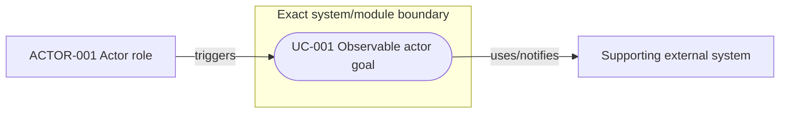
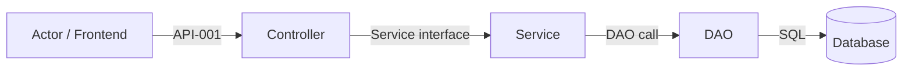
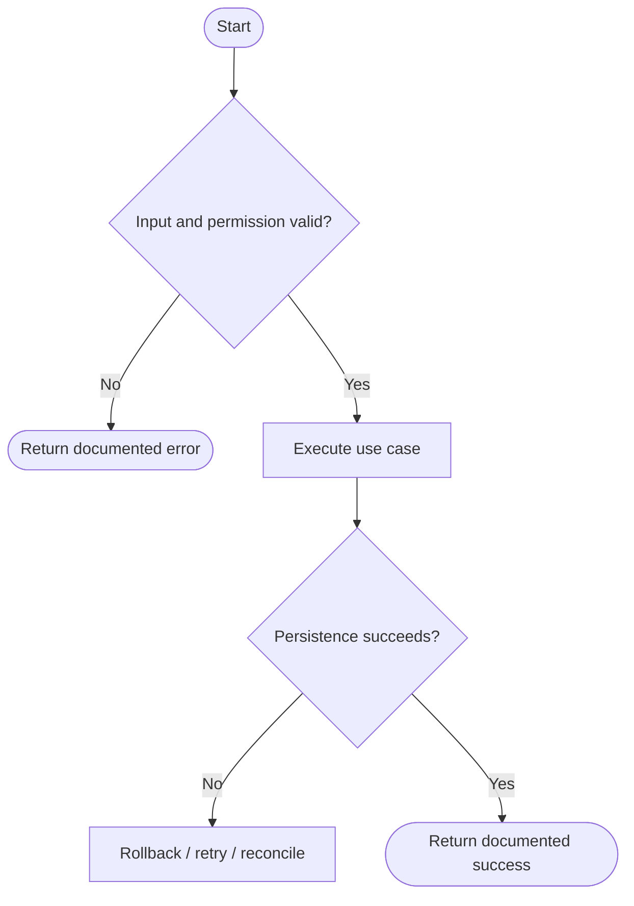
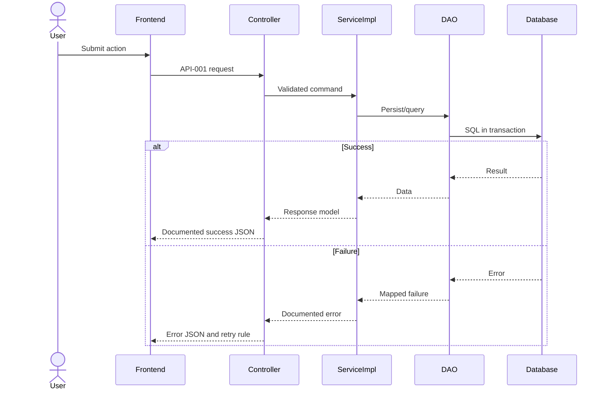
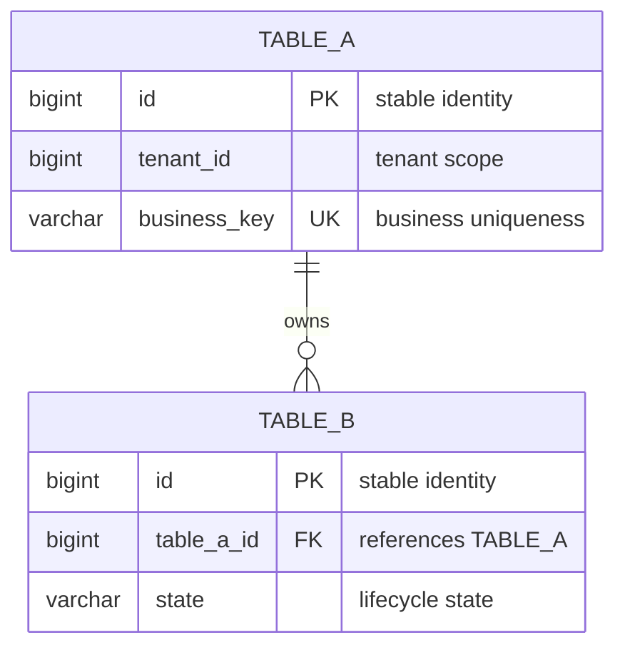

# <Specification title>

| Field | Value |
| --- | --- |
| Document | `YYYY-MM-DD-HH-MM-abstract.md` |
| Template Version | `2` |
| Status | `Draft` |
| Type | `Feature / Refactor / Bugfix / Architecture` |
| Complexity | `Simple / Complex` |
| Complexity Drivers | `<material interaction and decision-risk drivers, or None>` |
| Created | `YYYY-MM-DD HH:mm ZONE` |
| Updated | `YYYY-MM-DD HH:mm ZONE` |
| Owner | `<decision owner>` |
| Repository | `<repository>` |
| Scope | `<modules or bounded context>` |
| Source Requirement | `<user request / issue / ticket / brief>` |
| Baseline Revision | `<commit and branch, or explicit dirty-worktree snapshot>` |
| Amends | `None` |
| Supersedes | `None` |
| Depends On | `None` |
| Related Specs | `None` |
| Related Plans | `None` |

## 1. Summary

In one to three paragraphs, state the problem, selected direction, affected scope, and intended result. This section must independently answer why the change is needed, what will change, and what success looks like.

## 2. Background and Current State

### 2.1 Business and user context

### 2.2 Repository evidence

Name exact modules, paths, packages, symbols, call chains, consumers, contracts, tables, pages, configuration, tests, and predecessor Specs. Classify every material statement so an inference or stale runtime observation cannot masquerade as a current repository fact.

| Evidence ID | Classification | Exact path/symbol/decision/command | Observed fact | Design significance | Verification limit/freshness |
| --- | --- | --- | --- | --- | --- |
| `EVD-001` | Static repository / User decision / Inference / Runtime evidence | `<path:line, symbol, wording, or command>` | `<one observed fact>` | `<requirement/decision it constrains>` | `<what this does not prove, environment/date if runtime>` |

### 2.3 Problem statement and gap

Describe current behavior, desired behavior, the gap, and its impact. Separate static repository proof from runtime claims that were not verified.

### 2.4 Evidence and current-chain map

For a Complex Spec, trace every material entry/trigger through consumers, data, external dependencies, and side effects. For a Simple Spec, provide the smaller chain needed to prove the design.

| Entry/trigger | Current call chain | Data read/written | External dependency | Consumers | Evidence |
| --- | --- | --- | --- | --- | --- |
| `<entry>` | `<symbols in order>` | `<stores>` | `<system or None>` | `<callers>` | `<paths/symbols>` |

## 3. Goals and Non-goals

### 3.1 Goals

### 3.2 Non-goals

Define explicit exclusions so scope cannot silently expand during planning or implementation.

## 4. Requirements and Acceptance Criteria

| ID | Atomic requirement | Priority | Observable acceptance criteria | Source |
| --- | --- | --- | --- | --- |
| `REQ-001` | `<one verifiable behavior or constraint>` | Must | `<observable result>` | `<original user wording or decision>` |

Avoid requirements that say only “support,” “optimize,” or “improve.” Each item must be independently testable.

### 4.1 Scenario matrix

Required for a Complex Spec. Include main, alternative, failure, retry, duplicate, timeout, permission, empty-data, concurrency, rollback, and recovery scenarios when applicable. For a Simple Spec, use a short matrix only when it adds design information.

| Scenario | Actor/trigger | Preconditions | Main path | Alternative/failure path | Data/state change | Observable result | Requirements |
| --- | --- | --- | --- | --- | --- | --- | --- |
| `<scenario>` | `<actor>` | `<conditions>` | `<flow>` | `<failure/recovery>` | `<changes>` | `<result>` | `REQ-001` |

For Complex Specs, the minimum-depth validator expects two evidence/current-chain rows, three materially distinct scenario rows, three quality/constraint rows, and two conclusion chains. When the repository genuinely contains fewer real elements, write `Depth exception:` in the affected subsection and cite the exact evidence; never use it merely for brevity.

### 4.2 Use-case analysis

Read `references/requirements-use-case-analysis.md`. Identify real external roles/systems, then express actor goals with stable `ACTOR-*` and `UC-*` IDs. Use either a complete use-case table or a Mermaid `flowchart`; for complex or multi-actor behavior, prefer the visual system-boundary view plus concise detail. Do not draw Controller/Service/DAO calls as use cases.

#### 4.2.1 Actor inventory

| Actor ID | Actor/role | Goal and responsibility | Entry/channel | Permission/tenant context | Evidence |
| --- | --- | --- | --- | --- | --- |
| `ACTOR-001` | `<role/system>` | `<goal>` | `<page/API/event/job>` | `<context>` | `<path/symbol/user wording>` |

#### 4.2.2 Use-case artifact

Table form:

| ID | Use case/goal | Primary actor | Supporting actors/systems | Trigger | Preconditions | Main success outcome | Alternatives/failures | Postconditions | Requirements | Interfaces/pages | Tests |
| --- | --- | --- | --- | --- | --- | --- | --- | --- | --- | --- | --- |
| `UC-001` | `<action and goal>` | `ACTOR-001` | `<actors/systems>` | `<event>` | `<conditions>` | `<observable outcome>` | `<named branches>` | `<success/failure state>` | `REQ-001` | `API-001 / <page>` | `TEST-001` |

Mermaid form, when it communicates actors and boundaries more clearly:



Whichever form is selected, define the actor, trigger, preconditions, main success result, material alternative/failure outcomes, success/failure postconditions, and forward links to requirements, contracts/pages, models/tables, and tests. Add one `#### 4.2.x UC-NNN — Name` detail block when the chosen artifact cannot hold those semantics clearly.

## 5. Constraints, Assumptions, and Decisions

### 5.1 Confirmed constraints

### 5.2 Small-gap assumptions

| ID | Inference | Repository evidence | Why locally reversible | Impact if wrong |
| --- | --- | --- | --- | --- |
| `ASM-001` | `<minimal inference>` | `<path/convention>` | `<reason>` | `<impact>` |

### 5.3 Resolved decisions

| ID | Decision | Decision owner | Evidence and rationale | Requirements |
| --- | --- | --- | --- | --- |
| `DEC-001` | `<confirmed choice>` | `<owner>` | `<evidence>` | `REQ-001` |

### 5.4 Open major decisions

| ID | Question and options | Recommendation, not decision | Impact | Owner | Status |
| --- | --- | --- | --- | --- | --- |
| `DEC-002` | `<blocking choice>` | `<recommended option and why>` | `<scope/contract/data impact>` | User | Open |

## 6. Project Technology Context

Document the repository's actual programming languages and versions, frameworks, build tools, module structure, architecture style, persistence and migration tools, frontend stack, test frameworks, deployment model, and applicable repository instructions. Cite evidence for each material fact.

| Concern | Current choice | Repository evidence | Constraint on design |
| --- | --- | --- | --- |
| Language/runtime | `<...>` | `<manifest/path>` | `<...>` |

### 6.1 Java three-layer applicability

For Java package design, record whether the affected module already uses or the user explicitly selected the supported traditional three-layer profile. Cite the base package and existing evidence. Do not silently migrate an existing DDD, COLA, hexagonal, or custom structure; record the mismatch as an open major decision when structural change is required.

| Architecture profile | Base package | Evidence or explicit decision | Existing deviations | Design action |
| --- | --- | --- | --- | --- |
| Traditional Three-Layer / Other | `<base package>` | `<paths or DEC-*>` | `<None or exact deviations>` | `<apply profile / preserve current structure / ask user>` |

## 7. Architecture Design

### 7.1 System Architecture Design

Define the system context, current and target boundaries, actors, modules/services, data stores, external systems, trust/deployment boundaries, ownership, dependency direction, and why the selected architecture fits the repository.

For a Java three-layer design, include `biz.controller`, `biz.service`, `biz.service.impl`, `biz.dao`, `biz.config`, `biz.utils`, and `biz.domain`. Controllers depend on Service interfaces and transport/data objects, never directly on DAO or `service.impl`. Concrete implementations under `service.impl` own business orchestration and normal transaction boundaries. DAO owns persistence access rather than business policy. Config owns technical wiring, and Utils remains stateless and business-neutral.

#### 7.1.1 Architecture Mermaid view

For a Complex Spec, use a Mermaid `flowchart` with real component/store/system names and direction-labelled edges. Show trust, deployment, or ownership boundaries with subgraphs when applicable. A Simple Spec may use `N/A` only with an exact reason.



#### 7.1.2 Boundary and responsibility table

| Module/component | Capability and data owned | Inputs/outputs | Allowed dependencies | Forbidden responsibility | Requirements |
| --- | --- | --- | --- | --- | --- |
| `<name>` | `<ownership>` | `<contracts>` | `<dependencies>` | `<must not know/do>` | `REQ-001` |

### 7.2 High-Level Design

Summarize key use cases, selected collaboration model, main data/control flow, state ownership, source of truth, major design decisions, and alternative/failure outcomes. Keep this level understandable without class-by-class implementation detail.

#### 7.2.1 Critical business/control flowchart

For a Complex Spec, provide a separate Mermaid `flowchart` for the critical use case. Include decisions, validation/permission failures, retries, partial failures, rollback/recovery, and terminal outcomes as applicable.



#### 7.2.2 High-level decision and quality matrix

| Concern/use case | Required behavior | Selected mechanism | Failure/degradation behavior | Trade-off | Verification | Requirements |
| --- | --- | --- | --- | --- | --- | --- |
| `<concern>` | `<behavior/SLO>` | `<design>` | `<failure behavior>` | `<cost>` | `<test/evidence>` | `REQ-001` |

### 7.3 Detailed Design

Describe component/class responsibilities, exact collaboration and data transformations, validation/order of operations, state transitions, transaction boundaries, concurrency/idempotency, cache/external calls, failure/recovery, and observability. Cross-reference Chapters 8-14 instead of contradicting or duplicating them.

#### 7.3.1 Detailed component collaboration

| Step | Caller -> callee | Contract/symbol | Input/output mapping | State/data effect | Failure behavior | Requirements |
| --- | --- | --- | --- | --- | --- | --- |
| `1` | `<caller -> callee>` | `<API/service/DAO>` | `<mapping>` | `<effect>` | `<error/recovery>` | `REQ-001` |

#### 7.3.2 Critical-path Mermaid swimlane

For a Complex Spec, use a Mermaid `sequenceDiagram` as the swimlane. Include actor/frontend/controller/service/DAO/database/external participants as applicable, plus important validation, failure, retry, timeout, rollback, or asynchronous behavior.



#### 7.3.3 Transactions, consistency, concurrency, and idempotency

| Concern/state change | Owner and boundary | Mechanism/isolation/lock | Concurrent or duplicate behavior | Commit/visibility point | Failure result | Requirements/tests |
| --- | --- | --- | --- | --- | --- | --- |
| `<mutable fact>` | `<Service/transaction/store>` | `<transaction/version/key>` | `<race/duplicate rule>` | `<when authoritative>` | `<rollback/conflict/unknown>` | `REQ-001 / TEST-001` |

State who opens and joins each transaction, which writes are atomic, which external effects are not, how lost updates and duplicate requests are detected, and what the caller observes after a conflict or unknown outcome. “Transactional,” “eventually consistent,” and “idempotent” require exact boundaries and identities.

#### 7.3.4 Failure semantics, recovery, and reconciliation

| Failure point | Detection | Immediate control flow | Data/transaction state | Retry and idempotency | Caller/frontend result | Recovery/reconciliation owner | Verification |
| --- | --- | --- | --- | --- | --- | --- | --- |
| `<failure>` | `<exception/code/timeout/metric>` | `<reject/rollback/degrade>` | `<none/partial/committed/unknown>` | `<who, what, key, limit>` | `<interface outcome/UI action>` | `<automatic/job/operator>` | `TEST-001 / <runtime evidence>` |

Include each external boundary, asynchronous handoff, partial write, rollback failure, response loss after commit, retry exhaustion, stale cache/projection, and operator repair path that materially applies. Never use one generic “log and throw” row for unrelated failures.

#### 7.3.5 Observability and operational boundaries

| Signal/runbook | Emitting owner and point | Fields/dimensions | Sensitive-data rule | Success/failure threshold | Alert/dashboard/operator action | Verification boundary |
| --- | --- | --- | --- | --- | --- | --- |
| `<log/metric/trace/audit>` | `<component and lifecycle point>` | `<stable IDs, result, latency>` | `<mask/omit>` | `<expected or SLO>` | `<action and owner>` | `<static/integration/runtime>` |

Define correlation propagation, stable operation/result/error dimensions, metric cardinality controls, audit ownership, alert conditions, reconciliation visibility, and what can only be verified after deployment. Logging an exception without an actionable identity or owner is not an operational design.

#### 7.3.6 Conclusion evidence chain

For each material Complex-Spec conclusion, record `Evidence -> Constraint/Requirement -> Decision -> Consequence/Trade-off -> Verification`. If any link depends on an unresolved major assumption, move it to §5.4 and use a blocked verdict.

| Conclusion | Repository/user evidence | Constraint or requirement | Design decision | Consequence and trade-off | Verification and acceptance evidence |
| --- | --- | --- | --- | --- | --- |
| `<conclusion>` | `<path/symbol/decision>` | `REQ-001 / <constraint>` | `<selected design>` | `<benefit and cost>` | `TEST-001 / <observable evidence>` |

A Complex Spec normally needs at least two rows covering different decision classes, for example ownership/contract and consistency/failure handling. Do not split one conclusion into cosmetic duplicates merely to satisfy the row count.

## 8. Package Structure and Code File Tree

### 8.1 Current relevant tree

```text
<only repository paths relevant to this design>
```

### 8.2 Target tree

```text
<base-package>/biz
├── controller
├── service
│   └── impl
├── dao
├── config
├── utils
└── domain
    └── <only justified POJO role packages and files>
```

Expand this skeleton into exact CREATE / MODIFY / DELETE file paths and packages; do not put implementation order here. `impl` must remain nested under `service`. Omit unused optional packages rather than creating empty layers or every possible POJO suffix package.

### 8.3 Package and file responsibilities

| Operation | Path/package | Symbols | Responsibility | Dependencies | Requirements |
| --- | --- | --- | --- | --- | --- |
| Create / Modify / Delete | `<exact path>` | `<class/function/component>` | `<single responsibility>` | `<existing/new dependencies>` | `REQ-001` |

Explain moves or deletions, generated-file handling, registration/wiring ownership, and consumer impact. The target tree must be complete enough for a Plan to derive ordered file steps without inventing architecture.

## 9. Interface Definitions

Read `references/interface-contract-design.md`. Cover applicable HTTP, RPC, event/message, CLI, scheduled-job, and internal Service contracts.

### 9.1 Interface Inventory

Use one ID per atomic HTTP Method + URL or protocol operation. Split collection/detail/create/update/delete/status endpoints into separate IDs even when they share models or rules.

| ID | Name/purpose | Kind | Consumer | Owner | Method + URL / symbol / topic | Input | Output | Auth/tenant | Error model | Idempotency/version | Requirements |
| --- | --- | --- | --- | --- | --- | --- | --- | --- | --- | --- | --- |
| `API-001` | `<purpose>` | HTTP | `<frontend/page>` | `<module>` | `POST /exact/path` | `<Request>` | `<actual wrapper>` | `<rules>` | `<model>` | `<rules>` | `REQ-001` |

### 9.2 Per-interface Detailed Contracts

Repeat §9.2.x for every inventory ID. Inventory and detail items must be one-to-one.

#### 9.2.1 API-001 — <Interface name>

##### Identity and purpose

| Concern | Definition |
| --- | --- |
| Purpose/owner/consumer | `<business purpose, module, frontend page or caller>` |
| Protocol and endpoint | `HTTP POST /verified/application/path` |
| Content type/version | `application/json; <version>` |
| Auth/permission/tenant | `<exact sources and rules>` |
| Timeout/retry/rate limit | `<rules>` |
| Idempotency/concurrency | `<key, duplicate and concurrent behavior>` |

##### Request parameters

Document Path, Query, Header, Cookie, Multipart, and Body separately. Omit a location only with `None`.

| Name | Location | Type/format | Required/null | Default | Validation/range/enum | Meaning | Example | Source |
| --- | --- | --- | --- | --- | --- | --- | --- | --- |
| `<name>` | Path / Query / Header / Body | `<type>` | `<rules>` | `<value>` | `<exact rules>` | `<meaning>` | `<example>` | `<request/context>` |

If a Request Body exists, show its complete nested documentation shape. Every field key needs a line-end comment; real wire JSON does not contain comments.

```jsonc
{
  "field": "value", // Required. Exact meaning, validation rule, and relevant default/null semantics.
  "nested": { // Required/optional. Meaning of the nested object.
    "child": 1 // Required. Exact child-field meaning and allowed range.
  }
}
```

##### Success response

State the HTTP/protocol status and response headers, then show the actual repository wrapper and full nested payload. Do not use a class name or `...` as the response. Every field key needs a line-end comment.

```jsonc
{
  "code": "SUCCESS", // Stable application result code from the actual response wrapper.
  "message": "ok", // Result message and localization semantics.
  "data": { // Successful payload and its nullability.
    "id": 1001, // Stable resource identifier and frontend use.
    "status": "ACTIVE" // Current status; define all values and frontend meaning.
  }
}
```

| Field path | Type/format | Required/null/default | Validation/enum/precision | Meaning and source | Frontend use |
| --- | --- | --- | --- | --- | --- |
| `data.id` | `<type>` | `<rules>` | `<rules>` | `<source/meaning>` | `<display/state use>` |

##### Error responses

| Condition | HTTP/protocol status | Business code | Response shape | Retryable | Frontend handling |
| --- | --- | --- | --- | --- | --- |
| `<condition>` | `<status>` | `<code>` | `<wrapper>` | Yes / No | `<display/retry/refresh>` |

```jsonc
{
  "code": "ERROR_CODE", // Stable business error code and triggering condition.
  "message": "Readable message", // Display/logging semantics and localization behavior.
  "data": null // Error payload nullability or structured validation details.
}
```

##### Interface logic for frontend and consumers

1. `<precondition and authoritative context>`
2. `<validation and permission order>`
3. `<main query/calculation/state transition>`
4. `<database/cache/external calls and transaction boundary>`
5. `<side effects/events/audit/derived fields>`
6. `<duplicate/concurrency/timeout/failure/rollback behavior>`
7. `<frontend loading, confirmation, refresh/navigation, cache, retry, error, or polling behavior>`

##### Compatibility and verification

Name consumers, version/deprecation behavior, compatibility constraints, contract/validation/permission/error tests, and frontend fixtures/mocks. For non-HTTP contracts, replace URL/JSON-specific fields with the exact RPC/event/job/CLI protocol details while preserving the same design depth.

## 10. POJO and Data Model Design

### 10.1 POJO role classification and class necessity

Classify every proposed Java object by its repository-defined semantic role. State the exact local meaning of ambiguous `DO`, `VO`, or `Entity` terms. `POJO` is an umbrella term, DAO is an access component rather than a data carrier, and `VO` means View Object in this profile.

| Object/path | Selected role | Owner/boundary and consumers | Why a distinct class is necessary or reuse is safe | Mapping owner | Requirements |
| --- | --- | --- | --- | --- | --- |
| `<Type>` | PO / DO / DTO / View Object / BO / ORM Entity / Query / Command / Request / Response / Form / Param / PageQuery / PageResult | `<owner and crossings>` | `<concrete semantic difference or safe reuse evidence>` | `<mapper/factory/constructor or None>` | `REQ-001` |

Do not create parallel PO/DO/Entity/BO/DTO/VO/Request/Response types merely because architectural layers exist. Add a class only for a real ownership, contract, validation/exposure, lifecycle/invariant, persistence, projection, pagination, or independent-versioning boundary. Do not expose a persistence object as a public contract merely to reduce the class count.

### 10.2 Persistence objects, ORM entities, and business data objects

| Model | Kind | Ownership/lifecycle | Validation and state rules | Persistence | Requirements |
| --- | --- | --- | --- | --- | --- |
| `<name>` | PO / ORM Entity / BO / Other justified role | `<owner>` | `<rules>` | `<table/none>` | `REQ-001` |

Do not introduce Aggregate, Domain Service, Repository Port, or DDD Value Object concepts in the current traditional three-layer profile.

### 10.3 Field design

| Model.field | Type | Required/null/default | Validation and semantics | Source/mapping | Requirements |
| --- | --- | --- | --- | --- | --- |
| `<Type.field>` | `<language type>` | `<rules>` | `<meaning>` | `<DTO/PO/column>` | `REQ-001` |

### 10.4 Object flow and mapping relationships

Define mappings only between semantically distinct types. Name the conversion owner and sensitive/derived/defaulted fields. Avoid no-op mapper chains. When data crosses three or more roles, include an object-flow diagram or complete field-mapping table.

### 10.5 Reuse, inheritance, and composition decisions

For PO or ORM Entity inheritance, document the `is-a` or common-lifecycle reason, inherited fields and state rules, ORM table/discriminator/proxy behavior, identity and equality, serialization, migration, compatibility, and tests. Persistence inheritance is allowed but not mandatory; prefer composition when no substitutable persistence relationship exists.

Concrete classes under `biz.service.impl` must use composition and delegation by default. Do not introduce a business `BaseService` or Service inheritance tree merely for code reuse. Any framework-mandated or existing Template Method exception must explain why composition is insufficient and how substitutability and testability remain safe.

### 10.6 State transitions and lifecycle

Define allowed transitions, guards, side effects, invalid transitions, and concurrency/version rules.

### 10.7 Relational model consistency

When relational persistence applies, map persistence objects/ORM entities and relationship fields to the exact Chapter 11 ER entities/tables and keys. Confirm cardinality, optionality, tenant scope, ownership, lifecycle, and cascade/orphan behavior agree with the Mermaid ER diagram and per-table constraints. If no relational model exists, write evidence-backed `N/A`.

## 11. Database Design

Read `references/database-design.md`. If no database is read or changed, write evidence-backed `N/A` in the subsections. Otherwise use the repository's actual dialect, migration mechanism, naming, and access layer.

### 11.1 Table Inventory

| Table | Existing/new | Purpose and owner | Read/write paths | Change | Migration | Requirements |
| --- | --- | --- | --- | --- | --- | --- |
| `<schema.table>` | Existing / New | `<purpose/owner>` | `<DAO/mapper/query>` | Create / Alter / Read-only | `<new path or None>` | `REQ-001` |

### 11.2 Per-table Detailed Design

Repeat §11.2.x for every inventory table.

#### 11.2.1 <schema.table_name>

##### Purpose, ownership, and lifecycle

Define owning module and authoritative writer, readers, lifecycle/retention, tenant partitioning, sensitive/audit classification, expected row count, and growth.

##### Complete column design

| Column | Native type | Length/precision | Null | Default | Generated | PK/FK/unique/check | Meaning | Source/mapping | Example |
| --- | --- | --- | --- | --- | --- | --- | --- | --- | --- |
| `<column>` | `<dialect type>` | `<length>` | Yes / No | `<value>` | `<rule>` | `<constraint>` | `<meaning>` | `<PO/interface>` | `<example>` |

Explain missing/`NULL`/empty/zero semantics, enums/states, money rounding, time zone/clock, ID generation, immutability, tenant/audit/version fields, relationships, cascades, and data-object/interface mapping as applicable.

##### Keys, relationships, and constraints

##### Index inventory and per-index justification

| Index | Type/unique | Ordered columns/expressions | Predicate/include | Query and operation | Cardinality/selectivity | Sort/coverage role | Write/storage cost | Decision |
| --- | --- | --- | --- | --- | --- | --- | --- | --- |
| `<index>` | `<btree/unique/...>` | `<ordered keys>` | `<details>` | `<exact DAO/SQL access>` | `<evidence>` | `<role>` | `<cost>` | Add / Retain / Change / Remove |

For every index, explain its exact dialect definition, real filter/join/order/page query, column order, uniqueness/tenant/soft-delete/`NULL` behavior, selectivity, overlap/redundancy, write/build/lock cost, and `EXPLAIN` or test plan. Reject an index without an identified query.

##### Access patterns and SQL shape

| Operation | Caller | Predicate/join/order | Expected rows | Index/constraint | Lock/isolation | Failure/idempotency |
| --- | --- | --- | --- | --- | --- | --- |

##### Migration and historical-data handling

Define the exact new migration path/version, ordered DDL/data pseudocode, data profiling, backfill/default/nullability sequence, batching/restart, compatibility window, index build/locking, verification SQL, rollback limits, and forward-fix. Never modify an existing immutable migration.

##### Transaction, consistency, and recovery

Define transaction owner, isolation/locks, concurrent writes, idempotency/deduplication, cache invalidation, event/outbox relationship, partial failure, audit, and reconciliation/repair.

### 11.3 Entity-relationship diagram

Relational persistence requires a Mermaid `erDiagram`. Include every table from §11.1 and any directly related existing neighbor needed to explain ownership/cardinality. Show actual relationships and material PK/FK/UK fields; do not invent an FK because columns share a name. The diagram complements rather than replaces §11.2.

| ER entity | Physical table | Scope/change | Authoritative owner | Notes |
| --- | --- | --- | --- | --- |
| `TABLE_A` | `<schema.table_a>` | Existing / New / Alter / Read-only neighbor | `<module>` | `<tenant/lifecycle/enforcement>` |



State whether each depicted relationship is enforced by a database FK/constraint or by application logic, including optionality, tenant-key participation, update/delete behavior, and orphan handling. If Chapter 11 has no relational tables, write `N/A` with repository evidence instead of leaving a placeholder diagram.

## 12. Frontend Page Design

If the repository has no affected frontend, write `N/A` with repository evidence. Otherwise define:

- route, navigation/menu entry, page ownership, permissions, tenant scope, and deep-link behavior;
- page layout and component tree, responsive behavior, accessibility, focus/keyboard rules, and key copy;
- user flows, form fields, client/server validation, confirmations, destructive-action protection, and success feedback;
- API mapping, state ownership, caching, invalidation, optimistic/pessimistic updates, and refresh behavior;
- initial, loading, skeleton, empty, populated, partial, error, retry, disabled, read-only, and permission-denied states.

### 12.1 Route, navigation, permission, and page ownership

| Page | Route/deep link | Navigation entry | Owner | Permission/tenant guard | Unauthorized/missing behavior | Requirements |
| --- | --- | --- | --- | --- | --- | --- |
| `<page>` | `/exact/route` | `<menu/source page>` | `<frontend module>` | `<guard and context source>` | `<redirect/denied/not-found>` | `REQ-001` |

### 12.2 Layout and component tree

```text
<Page>
├── <Header / breadcrumb / actions>
├── <Filter or Form>
├── <Content / table / details>
└── <Feedback / dialog / toast>
```

Name component ownership, props/events, local versus shared state, reuse of repository components, modal/drawer ownership, and which elements remain mounted across loading/error transitions. Do not invent a new design system.

### 12.3 User flows, forms, and validation

| Flow/action | Preconditions | Ordered interaction | Client validation | Server outcome | Success behavior | Failure/recovery behavior | Contract |
| --- | --- | --- | --- | --- | --- | --- | --- |
| `<action>` | `<state/permission>` | `<click -> confirm -> request>` | `<field/cross-field rules>` | `<codes/states>` | `<refresh/navigation/focus>` | `<preserve/retry/error mapping>` | `API-001` |

For every field, align label/copy, source, control type, required/default, validation trigger, trim/null/empty semantics, dependencies, disabled/read-only rule, sensitive display, submitted field, and server error mapping with Chapter 9.

### 12.4 UI state and API/data mapping

| Page/component | Route/entry | User action | API/contract | State/error behavior | Permission | Requirements |
| --- | --- | --- | --- | --- | --- | --- |
| `<name>` | `/...` | `<action>` | `API-001` | `<states>` | `<permission>` | `REQ-001` |

| UI state | Entry condition | Visible components/copy | Enabled actions | Data/cache state | Exit transition | Test |
| --- | --- | --- | --- | --- | --- | --- |
| Initial / Loading / Empty / Populated / Partial / Validation error / Dependency error / Denied / Disabled | `<condition>` | `<exact behavior>` | `<actions>` | `<query/cache>` | `<next state>` | `TEST-001` |

Map each displayed/submitted field to an exact interface field and state its formatting, enum label, null fallback, precision/timezone behavior, sort/filter semantics, cache key, invalidation trigger, stale-data behavior, and optimistic/pessimistic update rule.

### 12.5 Accessibility, responsiveness, and interaction safety

Define keyboard order/shortcuts, focus placement and restoration, accessible names/descriptions, validation announcement, table/form semantics, contrast/status communication, screen-size behavior, overflow, long text, localization expansion, double-submit prevention, confirmation for destructive actions, and unsaved-change behavior as applicable. Map each rule to a component test or explicitly identified manual verification boundary.

## 13. Design Patterns and Architecture Principles

### 13.1 Selected patterns

| Pattern/principle | Concrete variation point or problem | Placement | Why direct code is insufficient | Repository alignment |
| --- | --- | --- | --- | --- |
| `<pattern>` | `<real problem>` | `<paths/types>` | `<reason>` | `<existing precedent>` |

### 13.2 Rejected patterns and simpler alternative

Record why Strategy, Template Method, Factory, Adapter, Facade, State, Observer, Command, Specification, or another candidate is unnecessary when direct design is clearer.

### 13.3 Architecture principles

Explain applicable choices around cohesion, coupling, information hiding, SOLID, YAGNI, testability, and maintainability. Show the three-layer dependency direction explicitly: Controller to Service interface, `service.impl` to DAO/domain objects, and DAO to persistence objects. Explicitly show how the model avoids class explosion and how concrete Service implementations use composition over inheritance. Do not claim a principle without showing how paths and dependencies enforce it.

## 14. Test Design

### 14.1 Unit tests

Define isolated behavior and invariant tests for concrete production symbols. State fixtures, action, assertions, boundaries, invalid input, state transitions, exceptions, concurrency decisions, and mocks/fakes only where unavoidable.

### 14.2 Integration, contract, persistence, component, and end-to-end tests

Separate these responsibilities from unit tests and use the repository's actual tools.

### 14.3 Test cases and data

| ID | Level | Target | Scenario/input | Expected assertion | Test double/data | Tool/path | Requirements |
| --- | --- | --- | --- | --- | --- | --- | --- |
| `TEST-001` | Unit | `<symbol>` | `<case>` | `<observable assertion>` | `<fixture>` | `<framework/path>` | `REQ-001` |

Cover happy paths, boundaries, invalid input, permissions, tenancy, retries/timeouts, concurrency, partial failure, rollback, compatibility, and regression cases as applicable.

## 15. Non-functional and Cross-cutting Design

Address applicable security, authorization, tenancy, privacy, secrets, performance, capacity, latency, caching, rate limiting, availability, audit, logging, metrics, tracing, alerting, internationalization, accessibility, operability, and maintainability. Give an evidence-backed `N/A` for materially relevant categories that do not apply.

## 16. Compatibility, Migration, Rollout, and Rollback

Define source/binary/API/data compatibility, old clients and data, migration/backfill sequence, feature flags, deployment order, staged rollout, pre/post-deploy checks, rollback limits, and forward-fix strategy.

## 17. Alternatives and Decisions

| Option | Advantages | Disadvantages/risks | Repository fit | Decision and rationale |
| --- | --- | --- | --- | --- |
| A | `<...>` | `<...>` | `<...>` | Selected / Rejected |

Record why the chosen design is preferable. Do not add alternatives merely to fill the table.

## 18. Risks and Open Questions

| ID | Risk/question | Probability | Impact | Mitigation or decision owner | Status |
| --- | --- | --- | --- | --- | --- |
| `RISK-001` | `<...>` | Low / Medium / High | `<...>` | `<...>` | Open / Closed |

## 19. Traceability Matrix

| Requirement | Use case | Architecture/packages | Interface | Model/database | Frontend | Tests | Acceptance evidence |
| --- | --- | --- | --- | --- | --- | --- | --- |
| `REQ-001` | `UC-001` | `§7 / §8` | `API-001` | `<model/table or N/A>` | `<page or N/A>` | `TEST-001` | `§4 criterion` |

Every `REQ-*` must map to design, tests, and acceptance. Every proposed contract, model, file, page, migration, and test must map back to a requirement or documented necessary infrastructure rationale.

## 20. Review and Acceptance

### 20.1 Original-request fidelity

Confirm every explicit request is represented by a `REQ-*` or explicit non-goal and that no requested outcome was weakened.

### 20.2 Repository and technical fidelity

Confirm paths, symbols, consumers, commands, language/framework choices, migration policy, and test tools against the current baseline.

### 20.3 Cross-section consistency

Confirm architecture, file tree, interfaces, fields, POJO/entity state, schema, page flows, failure semantics, security, compatibility, tests, and traceability describe one design.

For a Complex Spec, confirm the evidence map, scenario matrix, architecture/high-level/detailed sections, Mermaid architecture/flow/swimlane diagrams, and conclusion chains cover the same critical paths and failure semantics.

Confirm every interface inventory ID has one detailed contract with complete request rules, full commented success/error payloads, frontend logic, and field consistency. Confirm every database inventory table and index is expanded and tied to real models, queries, migrations, and tests.

Confirm requirements analysis contains evidenced actors and `UC-*` goals in a complete table or Mermaid use-case view, and that use-case conditions/outcomes agree with scenarios, interfaces, data effects, frontend states, and tests. Confirm relational data design contains a Mermaid `erDiagram` covering every inventory table and agreeing with physical names, PK/FK/UK fields, cardinalities, optionality, and enforcement rules.

### 20.4 Relationship and effective-design review

Confirm all predecessor links and exact sections, amendment/supersession scope, status, and unchanged effective content.

### 20.5 Final verdict

Use exactly one:

- `PASS — Ready for user review`
- `BLOCKED — User decision required`
- `REVISE — Internal inconsistency found`
