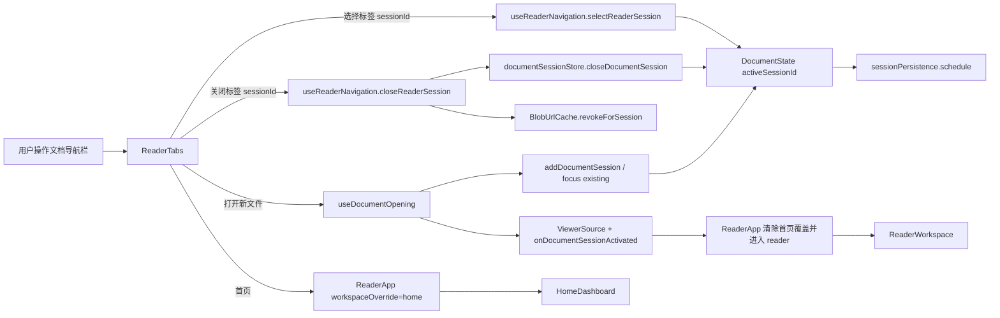

# 2026-08-16 14:21 SmartReader 阅读器文档导航栏优化 Spec

| Field | Value |
| --- | --- |
| Document | `2026-08-16-14-21-reader-document-navigation-bar.md` |
| Status | `Review` |
| Type | `Feature` |
| Created | `2026-08-16 14:21 CST` |
| Updated | `2026-08-16 15:14 CST` |
| Owner | User |
| Repository | `SmartReader` |
| Scope | React 阅读器文档导航栏、首页/阅读器工作区切换、文件打开与标签关闭交互 |
| Source Requirement | 2026-08-16 用户基于阅读器截图提出：标签栏支持关闭文件、在栏内打开新文件、从阅读页返回首页；随后要求使用 `egon-coding-writing-spec` 开始编写 Spec |
| Baseline Revision | `main` @ `94de3a9665a2ccb540d877609d48dda8d116c27c`；2026-08-16 14:21 CST 观察到干净工作区 |
| Amends | [SmartReader PDF Reader Design](../../superpowers/specs/2026-06-15-smartreader-pdf-reader-design.md) §Product Layout、§Architecture / Frontend Modules、§Open File Flow、§Cache Design 中关于阅读器内部标签条和关闭入口的局部设计 |
| Supersedes | `None` |
| Depends On | [SmartReader Stabilization Design](../../superpowers/specs/2026-06-17-smartreader-stabilization-design.md) §Target Architecture / Frontend Boundary、§Data Flow / Open PDF、§Data Flow / Switch Tab、§Feature Completion Rules / Cache |
| Related Specs | [SmartReader MVP Workbench Stabilization Design](../../superpowers/specs/2026-06-18-smartreader-mvp-workbench-stabilization-design.md) §Frontend Architecture / App Boundary、§Core Flows / Open PDF、§UI Design / Reader Workspace；[SmartReader Home Top Bar Design](../../superpowers/specs/2026-07-01-smartreader-home-topbar-design.md) §Product Behavior / Top Bar、§Product Behavior / Open File、§Architecture / State；[SmartReader Home Completion Design](../../superpowers/specs/2026-07-03-smartreader-home-completion-design.md) §Product Behavior / Home Shell、§Product Behavior / Route Consistency、§Architecture / State Ownership |
| Related Plans | [SmartReader 阅读器文档导航栏实施 Plan](../plan/2026-08-16-15-14-reader-document-navigation-implementation.md) §7 Ordered File-by-file Implementation Steps、§8 Test, Validation, and Quality Gates、§10 Requirement-to-Step Traceability Matrix |

## 1. Summary

SmartReader 当前已经具备多文档会话、标签选择、当前标签关闭、文件打开、快捷键和会话持久化能力，但这些能力分散在阅读器标签条和阅读工具栏中：`ReaderTabs` 只负责选择，关闭只存在于工具栏右侧，打开文件也不在标签条中；阅读器没有直接返回首页的入口。用户因此无法把顶部区域当作完整的文档生命周期导航使用。

本设计把现有 `ReaderTabs` 提升为首页与阅读器共享的文档导航栏：左侧固定首页入口，中部为可横向滚动的文档标签，每个标签提供独立关闭按钮，右侧固定打开新文件入口。首页切换不销毁文档会话；在首页点击文档标签或成功打开文件会返回阅读器。阅读工具栏移除重复的打开与关闭入口，继续专注于搜索、翻页、缩放、书签、批注和设置。

本次只调整 React 前端状态编排、组件结构、样式和测试。现有 `DocumentSession`、Blob URL 生命周期、`file.open`/`tab.close` 命令、会话持久化、Rust/Tauri 命令和 SQLite 表结构保持不变。

## 2. Background and Current State

### 2.1 Business and user context

用户在阅读 PDF 时把顶部标签条视为“已打开文件”的直接管理区域。当前体验存在三个连续缺口：

1. 标签本身不能直接关闭，只能到工具栏右端寻找全局关闭按钮。
2. 标签条没有“新建/打开文件”入口，新增文件与标签管理的空间关系不明确。
3. 阅读页没有显式返回首页路径，用户容易把关闭文件或关闭窗口误认为唯一退出阅读器的方式。

期望结果不是新增一套文档管理系统，而是让已有的打开、选择、关闭和首页切换能力在同一条导航栏上形成闭环。

### 2.2 Repository evidence

| Evidence | Current responsibility or behavior | Design significance |
| --- | --- | --- |
| `src/reader/ReaderTabs.tsx:4-38` / `ReaderTabs` | Props 只有 `sessions`、`activeSessionId`、`onSelectSession`；每个标签只有标题与页码提示 | 标签条当前无法关闭指定会话、打开新文件或进入首页 |
| `src/reader/ReaderToolbar.tsx:21-51,95-122,259-310` / `ReaderToolbar` | 工具栏同时承载原生打开、浏览器文件选择和当前标签关闭 | 文档生命周期动作与阅读动作混杂，且关闭只能作用于当前标签 |
| `src/app/ReaderWorkspaceView.tsx:20-66,122-164` / `ReaderWorkspaceView` | 在阅读器内部组合 `ReaderTabs` 与 `ReaderToolbar`，并把 `closeActiveTab`、打开文件回调下传给工具栏 | 若导航栏要同时出现在首页和阅读器，所有权必须上移到共享工作区外壳 |
| `src/reader/ReaderWorkspace.tsx:3-37` / `ReaderWorkspace` | `tabs` 是阅读器网格的首行插槽 | 共享导航栏后应从阅读器内部网格移出，避免首页重复实现 |
| `src/reader/hooks/useReaderNavigation.ts:31-66` / `closeActiveTab` | 只关闭 `activeSession.id`，撤销该会话 Blob URL，并同步后继 viewer source | 标签级关闭需要推广为按 `sessionId` 关闭，同时保留当前标签快捷键包装 |
| `src/documents/documentSessionStore.ts:82-100` / `closeDocumentSession` | 可按任意 `sessionId` 删除；关闭非活动会话不改变活动会话；关闭活动会话选择左侧邻居；最后一个关闭后活动会话为 `null` | 底层状态规则已满足主要关闭语义，无需新增 store 或模型 |
| `src/cache/blobUrlCache.ts:16-25` / `revokeForSession` | 按会话撤销并移除 Blob URL，目标不存在时安全返回 | 任意标签关闭必须继续经过该资源释放入口 |
| `src/reader/hooks/useDocumentOpening.ts:51-124,163-248` / `openBytes`、`openPdf` | 原生、浏览器、拖拽、Open With 和最近文件最终创建或聚焦 `DocumentSession` 与 viewer source | 导航栏打开入口必须复用此链路，不得另建文件打开实现 |
| `src/documents/documentSessionStore.ts:21-53` / `addDocumentSession` | 相同 `documentKey` 已打开时只聚焦已有会话；新文档追加到 sessions 末尾并激活 | “打开新文件”仍须保留去重聚焦语义 |
| `src/app/ReaderApp.tsx:94-159,497-529,940-963` / `workspaceOverride`、`activeWorkspace` | `activeWorkspace = workspaceOverride ?? (activeSession ? 'reader' : 'home')`；工具工作区关闭时直接清空 override | 显式从阅读器进入首页后，必须确保文档选择/打开能退出首页；工具关闭也要回到来源主工作区 |
| `src/app/ReaderWorkspaceSwitch.tsx:318-437` | `reader` 与 `home` 是互斥渲染分支；首页打开入口与阅读器入口分别接线 | 共享导航栏应位于 switch 外部，仅在 home/reader 主工作区显示 |
| `src/home/HomeDashboard.tsx:161-182,379-398` | 首页已有原生打开失败后回退隐藏浏览器 input 的行为 | 导航栏新入口必须保持相同降级语义；首页既有打开按钮继续有效 |
| `src/commands/commandRegistry.ts:1-59` 与 `src/reader/hooks/useReaderCommands.ts:47-60` | 已存在 `file.open` (`Meta+O`) 和 `tab.close` (`Meta+W`) | UI 移位不得删除或改写快捷键契约 |
| `src/app/ReaderApp.tsx:199-229`（当前会话 effect）与 `src/persistence/persistenceApi.ts:28-40,112-130` | sessions 变化会调度 `PersistedReaderSession` 写入 | 关闭最后标签仍需持久化空会话，首页切换本身不应改变 sessions |
| `src/app/styles.css:79-103,1696-1742,3127-3245,3430-3441` | app shell、首页 shell、阅读器网格、标签条和窄窗口工具栏都有现有响应式规则 | 共享导航栏需要调整网格行，但不得破坏首页、阅读器正文和窄窗口布局 |
| `src/app/App.test.tsx:425-506,1051-1086` | 已覆盖打开后进入阅读器、显示标签、关闭最后标签和持久化空会话 | 新测试应复用现有应用级假 bridge/persistence 体系，而不是另建端到端框架 |
| `README.md`“技术栈”“项目结构”“常用命令” | React 18、TypeScript、Vite、Vitest、Tauri v2、Rust、rusqlite/SQLite；文档只改可用 `git diff --check` | 本 Spec 的技术、验证和静态证据边界以当前仓库为准 |

### 2.3 Problem statement and gap

静态代码可以确认：底层已支持多会话、按 ID 删除和打开文件，但 UI 没有把这些能力放在文档导航语境中。用户截图反映的运行时体验与源码结构一致；本轮没有启动 Tauri 或浏览器，因此不把视觉尺寸、真实 PDF 交互或操作系统文件对话框结果描述为已运行验证。

缺口的核心是应用主工作区状态与文档会话状态没有在顶部形成统一入口。单纯给当前标签加一个 X 只能解决局部关闭；单纯增加首页按钮则会暴露 `workspaceOverride` 的返回来源问题；单纯复制“打开”按钮则会增加重复入口而不保证原生/浏览器/Open With 的一致切换。设计必须同时闭合文档导航、资源释放、工作区切换和降级打开路径。

## 3. Goals and Non-goals

### 3.1 Goals

- 将顶部区域定义为首页与阅读器共享的文档导航栏。
- 提供固定首页入口，并保证返回首页不会关闭或重建已打开文档。
- 允许关闭任意文档标签，保持活动会话、viewer source、Blob URL 和持久化状态一致。
- 在导航栏中提供固定的新文件打开入口，复用全部现有打开链路。
- 使首页、文档标签、工具工作区之间的返回来源明确且可测试。
- 将阅读工具栏收敛为阅读动作集合，移除重复的文件打开/关闭入口。
- 保持现有快捷键、数据模型、数据库、Tauri 命令和 PDF viewer 边界兼容。
- 保证长文件名、多标签、窄窗口、鼠标和键盘操作都可用。

### 3.2 Non-goals

- 不引入 React Router、URL 路由、标签拖拽排序、固定标签、分组标签或最近关闭标签恢复。
- 不改变 `DocumentSession`、`PersistedReaderSession` 或 SQLite schema。
- 不改变重复桌面路径聚焦已有标签的规则。
- 不改变 PDF 渲染、搜索、分页、缩放、书签、批注、收藏和标签业务。
- 不移除首页 `HomeTopBar` 与快速开始区域中已有的打开文件入口；首页允许保留面向新用户的重复入口。
- 不把共享文档导航栏扩展到 settings、tags、import、compare、annotations、bookmarks 等工具工作区的视觉外壳。
- 不新增第三方依赖，不启动项目，不在 Spec 阶段生成实现 Plan。

## 4. Requirements and Acceptance Criteria

| ID | Atomic requirement | Priority | Observable acceptance criteria | Source |
| --- | --- | --- | --- | --- |
| `REQ-001` | 首页与阅读器主工作区顶部必须渲染同一个文档导航栏 | Must | 首页和任一已打开 PDF 的阅读页均能看到首页入口、文档标签区域和打开新文件入口；工具工作区保持现有外壳 | 用户要求“这个 bar”形成完整路径；已确认方案覆盖首页与阅读页 |
| `REQ-002` | 点击导航栏首页入口不得关闭或重建任何文档会话 | Must | 从阅读器进入首页后，sessions 数量、每个 session 的页码/缩放/历史不变；对应 Blob URL 不被撤销 | 用户要求“这个页面，没有回到首页的路径” |
| `REQ-003` | 在首页点击任一已打开文档标签必须切回阅读器并激活目标文档 | Must | 首页状态下点击标签后阅读器出现，目标标签为活动状态，viewer source 对应目标 session | 首页切换必须可逆，不能形成单向路径 |
| `REQ-004` | 每个文档标签必须提供按该标签 `sessionId` 关闭的按钮 | Must | 当前与非当前标签均有可访问关闭按钮；关闭按钮不会先选择目标标签，也不会关闭其他标签 | 用户要求“目前不支持关闭文件” |
| `REQ-005` | 关闭行为必须保持现有会话回退与资源释放规则 | Must | 关闭非活动标签不切换活动文档；关闭活动标签选择左侧邻居；关闭最后标签进入首页；目标 Blob URL 被撤销；空会话被调度持久化 | 现有 `closeDocumentSession`、`BlobUrlCache` 和会话持久化契约 |
| `REQ-006` | 导航栏必须提供固定的“打开新文件”入口并复用原生/浏览器降级逻辑 | Must | 原生能力可用时调用 `openPdf`；原生调用拒绝时触发隐藏浏览器选择器；用户取消时状态不变；成功后进入阅读器并激活新增或已存在标签 | 用户要求“支持新打开一个文件，到这里” |
| `REQ-007` | 阅读工具栏必须移除重复的打开文件和关闭当前标签入口 | Must | 阅读工具栏不再渲染“打开”、浏览器选择和右端关闭标签按钮；搜索、导航、缩放、书签、批注、收藏、设置保持可用 | 已确认的工具栏职责收敛方案 |
| `REQ-008` | 导航栏必须在多标签与窄窗口下保持两端动作可用 | Must | 首页和打开入口始终可见；只有中间标签区域横向滚动；长标题截断；新增或激活标签滚动到可见区域 | 用户截图与现有 `overflow-x` 布局约束 |
| `REQ-009` | 导航栏必须满足按钮语义、键盘聚焦和可访问名称要求 | Must | 不存在 button 嵌套；首页、标签、关闭和打开均可键盘聚焦；关闭活动标签后焦点转移到后继活动标签或首页；图标按钮有中文 accessible name | 桌面应用可访问性与现有 Testing Library role 查询约定 |
| `REQ-010` | 现有 `Meta+O`、`Meta+W` 和标签切换快捷键契约必须保持不变 | Must | `file.open` 仍走现有打开链路；`tab.close` 仍关闭当前活动标签；Control+Tab 系列仍选择会话 | 现有 `CommandRegistry` 和偏好设置契约 |
| `REQ-011` | 本功能不得修改持久化 schema、Rust/Tauri 命令或引入新依赖 | Must | `src-tauri`、迁移文件、`PersistenceApi` 数据结构和 dependency manifest 无功能性改动 | 方案限定为前端导航优化；仓库已有完整会话能力 |
| `REQ-012` | 从首页打开工具工作区后，关闭工具必须返回首页；从阅读器打开则返回阅读器 | Must | 存在活动文档时：首页→设置→关闭仍回首页；阅读器→设置→关闭仍回阅读器；若阅读来源已无文档则安全回首页 | 共享首页入口引入后的必要状态闭环 |

## 5. Constraints, Assumptions, and Decisions

### 5.1 Confirmed constraints

- 只编写 Spec，不编写 Plan，不修改生产代码，不启动项目。
- 使用当前 React + TypeScript + hooks + typed props 架构，不新增框架或依赖。
- `ReaderApp` 继续拥有应用级工作区和会话编排；展示组件不访问持久化或 Tauri 命令。
- `PdfViewerBridge` 边界不变；导航组件不能导入 `@react-pdf-viewer/*`。
- SQLite 迁移不可修改；本功能无 schema 需求，因此不创建新迁移。
- 保持 `file.open`、`tab.close` 及用户自定义快捷键兼容。
- 用户将在实现完成后自行进行运行时验证；代理不自动启动项目。

### 5.2 Small-gap assumptions

| ID | Inference | Repository evidence | Why locally reversible | Impact if wrong |
| --- | --- | --- | --- | --- |
| `ASM-001` | “返回首页”只切换工作区，不关闭文档 | 首页和阅读器已是 `AppWorkspace`，sessions 独立存放在 `DocumentState` | 只影响本地 UI 状态，可通过一个回调调整 | 若用户希望返回首页同时关闭所有文件，需要重新定义破坏性语义和确认流程 |
| `ASM-002` | 共享导航栏只显示在 home/reader，不显示在工具工作区 | 工具工作区已有独立 header 与 `返回首页`/关闭动作 | 视觉范围局部，可后续扩展 | 若需要全局常驻导航，需要重新调整所有工具工作区高度和返回语义 |
| `ASM-003` | 关闭标签不增加确认弹窗 | PDF 原文件不被修改；书签/批注显式持久化；当前关闭已无确认 | 行为与现有快捷键一致，易于后续增加脏状态守卫 | 若未来出现未保存编辑器，关闭前必须引入 dirty-state 契约 |
| `ASM-004` | 打开或选择文档后应自动把活动标签滚入可视区 | 当前标签区已横向滚动；用户要求新文件“到这里” | 纯 UI 行为，不影响状态或数据 | 若用户希望保持手动滚动位置，可移除自动滚动 effect |
| `ASM-005` | 首页 `HomeTopBar` 的 `打开文件` 和快速开始入口继续保留 | 已批准的 Home Top Bar Spec 明确要求首页打开入口，当前首页也有多入口 | 只造成首页内有多个等价入口，不影响阅读器密度 | 若用户要求全应用只保留一个入口，需要另行修订已批准首页设计 |
| `ASM-006` | 关闭活动标签后的焦点优先落在新活动标签，关闭最后标签后落在首页按钮 | `closeDocumentSession` 已定义新活动标签；导航栏是关闭动作的直接上下文 | 局部焦点策略，可由组件测试固定 | 若产品希望焦点进入首页内容，需要改焦点目标但不改业务状态 |

### 5.3 Resolved decisions

| ID | Decision | Decision owner | Evidence and rationale | Requirements |
| --- | --- | --- | --- | --- |
| `DEC-001` | 采用“首页固定入口 + 中间文档标签 + 右侧打开入口”的共享导航栏 | User | 用户在收到该方向方案后明确要求开始写 Spec | `REQ-001` 至 `REQ-008` |
| `DEC-002` | 保留 `ReaderTabs.tsx` 文件与 `ReaderTabs` 符号，在其内部扩展为文档导航栏，不做无必要重命名 | Spec inference | 最小变更，现有消费者与测试路径清晰；组件仍以文档标签为核心 | `REQ-001`、`REQ-011` |
| `DEC-003` | 将共享导航栏组合权上移到 `ReaderApp`，从 `ReaderWorkspace` 移除 `tabs` 插槽 | Spec inference | `ReaderApp` 同时拥有 `activeWorkspace` 与 documents；这是 home/reader 唯一共同祖先 | `REQ-001`、`REQ-002`、`REQ-003` |
| `DEC-004` | `useReaderNavigation` 新增按 ID 关闭，`closeActiveTab` 作为快捷键包装保留 | Spec inference | 底层 store 已按 ID 删除；避免复制资源释放和 viewer 同步逻辑 | `REQ-004`、`REQ-005`、`REQ-010` |
| `DEC-005` | `useDocumentOpening` 增加“文档会话已激活”通知，统一清除显式首页覆盖 | Spec inference | 原生、浏览器、拖拽、Open With、最近文件都汇入 `openBytes`，单点通知覆盖最完整 | `REQ-003`、`REQ-006` |
| `DEC-006` | 使用一个轻量的主工作区返回目标状态保存工具工作区来源，不引入路由库 | Spec inference | 现有 `workspaceOverride` 是直接状态机；一个 home/reader 返回目标即可闭环 | `REQ-012`、`REQ-011` |
| `DEC-007` | 首页既有打开入口保留，阅读器工具栏的重复打开/关闭入口移除 | User / predecessor compatibility | 满足用户对 bar 的要求，同时不破坏已批准首页 Top Bar 设计 | `REQ-006`、`REQ-007` |

### 5.4 Open major decisions

None。当前范围内没有会改变持久化、外部契约、安全边界或不可逆行为的未决选择。

## 6. Project Technology Context

| Concern | Current choice | Repository evidence | Constraint on design |
| --- | --- | --- | --- |
| Language/runtime | TypeScript 6.0、ES2022；Rust 2021 | `package.json`、`tsconfig.app.json`、`src-tauri/Cargo.toml` | 前端接口使用严格 TypeScript；Rust 边界不改 |
| Frontend | React 18.3.1、React DOM 18.3.1 | `package.json` | 使用函数组件、hooks、显式 props |
| Build | Bun scripts、Vite 8、`@vitejs/plugin-react` | `package.json`、`vite.config.ts` | 验证使用仓库脚本，不添加构建步骤 |
| Desktop shell | Tauri 2.11，窗口最小 860×560、默认 1180×780 | `src-tauri/tauri.conf.json` | 重点覆盖桌面宽度与 860px 附近窄窗口 |
| PDF viewer | `@react-pdf-viewer` 3.12.0、PDF.js 3.11.174 | `package.json`、`README.md` | 导航层不接触 viewer 插件内部 |
| Icons | `lucide-react` 1.18.0 | `package.json` 与当前组件 import | 首页、加号、关闭图标复用现有图标集 |
| Architecture | `ReaderApp` 编排 + feature components + focused hooks + typed persistence/Tauri adapters | `src/app/ReaderApp.tsx`、`src/reader/hooks/*`、`src/persistence/persistenceApi.ts` | 新状态和动作进入现有边界，不建新 service 层 |
| Persistence | React typed API → Tauri invoke → Rust rusqlite/SQLite；会话 debounce 写入 | `src/persistence/persistenceApi.ts`、`src/reader/hooks/useReaderPersistence.ts`、`src-tauri/src/db.rs` | 首页切换不写 schema；sessions 变化继续触发现有保存 |
| Migration | `schema_migrations` + append-only SQL migrations 001–006 | `src-tauri/src/db.rs:373-426`、`src-tauri/src/migrations/*` | 本设计无迁移；既有 migration 不修改 |
| Tests | Vitest 4.1.9 + jsdom + Testing Library；Rust cargo tests | `vite.config.ts`、`package.json`、`src/**/*.test.*` | 组件与应用流使用 role/accessibility 断言；不自动启动应用 |
| Repository instructions | 根目录未发现磁盘上的 `AGENTS.md`；本会话提供的 Main Agent Rules 适用 | 仓库扫描与会话上下文 | 最小变更、保护无关文件、验证真实执行边界 |

### 6.1 Java three-layer applicability

N/A。受影响模块是 React/TypeScript 前端，不包含 Java 包，也不需要迁移到 Java 三层结构。当前自定义架构由 `src/app`、`src/reader`、`src/documents`、`src/platform` 和 `src/persistence` 等 feature boundary 组成，本 Spec 保持该结构。

| Architecture profile | Base package | Evidence or explicit decision | Existing deviations | Design action |
| --- | --- | --- | --- | --- |
| Other: React composition + hooks | `src/` | `README.md` 项目结构；`ReaderApp` 与 reader hooks | N/A | 保持当前结构，不引入 Java/DDD/COLA 分层 |

## 7. Architecture Design

### 7.1 Architecture overview

设计采用现有状态模型上的直接扩展：

- `ReaderApp` 继续拥有 `documents`、`workspaceOverride`、活动工作区推导和打开文件编排，并在 home/reader 分支外渲染共享 `ReaderTabs`。
- `ReaderTabs` 负责导航栏 DOM、视觉状态、隐藏浏览器文件 input、活动标签滚动和关闭后焦点恢复；它只通过 props 触发业务动作。
- `useReaderNavigation` 负责所有会话选择/关闭与 viewer source 同步，新增 `closeReaderSession(sessionId)`。
- `useDocumentOpening` 在成功创建或聚焦会话时调用 `onDocumentSessionActivated(documentKey)`，使任何打开来源都能退出显式首页状态。
- `ReaderWorkspace` 和 `ReaderToolbar` 移除已上移的标签/打开/关闭职责。
- `ReaderApp` 保存工具工作区进入前的主工作区目标，工具关闭后回到 home 或 reader；若 reader 不再可用则回 home。

不新增全局 Context、路由框架或业务 service。文档会话和工作区仍是两个正交状态：前者描述“哪些文件打开及哪个活动”，后者描述“用户当前看哪个应用表面”。

### 7.2 Module boundaries and responsibilities

| Module/component | Responsibility | Inputs/outputs | Dependencies | Requirements |
| --- | --- | --- | --- | --- |
| `ReaderApp` | 共享导航栏组合、主工作区切换、工具返回来源、打开成功后进入阅读器 | `documents`、`activeWorkspace`、navigation callbacks | reader hooks、bridge、switch | `REQ-001`、`REQ-002`、`REQ-003`、`REQ-006`、`REQ-012` |
| `ReaderTabs` | 展示首页/标签/打开入口，管理 UI-local input/ref/focus/scroll | `ReaderTabsProps` → 回调 | React refs/effects、lucide icons | `REQ-001`、`REQ-004`、`REQ-006`、`REQ-008`、`REQ-009` |
| `useReaderNavigation` | 按 session 选择/关闭，释放 Blob URL，必要时同步 viewer source | session ID → `DocumentState`/`ViewerSource` 更新 | store、`BlobUrlCache` | `REQ-003`、`REQ-004`、`REQ-005`、`REQ-010` |
| `documentSessionStore` | 纯会话增删选与回退规则 | `DocumentState` → 新 state | 无 UI 依赖 | `REQ-005`、`REQ-006` |
| `useDocumentOpening` | 所有文件来源归一、会话创建/聚焦、viewer source 创建、激活通知 | source/bytes → session + callback | bridge、cache、store | `REQ-003`、`REQ-006` |
| `ReaderWorkspace` | 阅读器 toolbar/body/status 布局，不再拥有共享标签行 | reader content slots | React | `REQ-001`、`REQ-007` |
| `ReaderToolbar` | 搜索、历史、翻页、缩放、书签、批注、收藏、设置 | reader action callbacks | viewer-facing callbacks | `REQ-007`、`REQ-010` |
| `ReaderWorkspaceSwitch` | 渲染当前 workspace，减少已上移 reader-only props | `activeWorkspace` 和 workspace props | home/settings/tool/reader components | `REQ-001`、`REQ-012` |
| session persistence effect | sessions 变化后调度最新会话快照 | `documents.sessions` → `saveReaderSession` | debounce、PersistenceApi | `REQ-005`、`REQ-010` |

### 7.3 Call chain, control flow, and data flow



#### 首页切换

1. `ReaderTabs.onOpenHome()` 调用 `ReaderApp.openHomeWorkspace()`。
2. `openHomeWorkspace()` 设置 `workspaceOverride = 'home'`，不修改 `documents`、`viewerSource` 或 cache。
3. `activeWorkspace` 变为 `home`，导航栏保持渲染，`HomeDashboard` 出现。
4. 文档标签的活动视觉取消，首页按钮设置 `aria-current="page"`。

#### 选择已打开文档

1. `ReaderTabs` 发送目标 `sessionId`。
2. `ReaderApp.openReaderSession(sessionId)` 先调用 `selectReaderSession(sessionId)`，再清除 home/tool override 与工具返回目标。
3. `useReaderNavigation` 使用 `selectSession` 更新活动会话并从 `BlobUrlCache` 同步 viewer source。
4. active tab 自动滚动进入可视区域，reader 分支渲染。

#### 关闭任意文档

1. 关闭按钮发送自身 `sessionId`，不会触发兄弟选择按钮。
2. `closeReaderSession` 撤销目标 Blob URL，并调用 `closeDocumentSession`。
3. 只有 `activeSessionId` 发生变化时才调用 `syncViewerSource`，避免关闭后台标签时无必要重置 viewer source。
4. sessions effect 调度最新快照；最后一个关闭时 `activeSession` 为 `null`，主工作区解析为 home。
5. 组件把焦点放到新活动标签；无标签时放到首页按钮。

#### 打开新文件

1. 原生能力可用时调用现有 `openPdf()`；返回 `false` 代表用户取消，不触发浏览器 fallback。
2. 原生 Promise 拒绝或同步抛错时，导航栏触发自身隐藏 file input。
3. 浏览器选择、拖拽、Open With、最近文件与原生打开均汇入 `openBytes`。
4. `openBytes` 创建或聚焦会话，创建 viewer source，并调用 `onDocumentSessionActivated(documentKey)`。
5. `ReaderApp` 清除显式首页/工具返回状态，进入 reader；新活动标签滚动可见。

### 7.4 Transaction, consistency, concurrency, and idempotency

- React 状态更新继续使用函数式 `setDocuments(current => next)`，以当前 state 作为关闭和选择的唯一一致性基线。
- `closeReaderSession` 必须在同一状态更新中比较 `current.activeSessionId` 与 `next.activeSessionId`；关闭非活动标签不重绑 viewer source。
- 多次关闭同一、已不存在的 `sessionId` 应保持幂等：`revokeForSession` 无目标时返回，`closeDocumentSession` 过滤结果不变。
- 相同桌面路径重复打开继续由 `documentKey` 去重并聚焦已有 session，不创建重复标签。
- session persistence 使用现有 debounce，只保留最后快照；本设计不新增事务或锁。
- UI-local `pendingFocusSessionId` 只负责下一次 render 后聚焦，不参与业务数据持久化。

### 7.5 Failure semantics and recovery

- 用户取消原生或浏览器文件选择：不创建标签、不切换工作区、不显示错误。
- 原生对话框调用拒绝：打开隐藏浏览器选择器；浏览器选择器也取消时保持原状。
- PDF 读取/验证失败：沿用现有 `useDocumentOpening`/session error 语义，不关闭其他标签。
- 关闭不存在的标签：安全 no-op，不改变活动 viewer。
- 目标活动标签的 Blob URL 缺失：`syncViewerSource` 设置 `null`，由现有 reader 恢复/错误路径处理，不借用其他 session URL。
- session persistence 失败：沿用现有非阻塞策略；运行时 sessions 仍保持用户操作结果。
- 工具工作区来源为 reader 但返回时已无活动 session：解析到 home，不渲染空 reader。

### 7.6 Observability and operational boundaries

本功能没有服务器、远程日志、指标或 tracing 边界。组件不新增 console 日志。可观测证据由可访问 DOM 状态、fake bridge 调用、Blob URL revoke spy、`saveReaderSession` 调用和 `DocumentState` 断言提供。真实窗口尺寸、操作系统文件对话框与 PDF 视觉效果属于用户后续手工验证，不在 Spec 阶段声称已验证。

## 8. Package Structure and Code File Tree

### 8.1 Current relevant tree

```text
src/
├── app/
│   ├── ReaderApp.tsx
│   ├── ReaderWorkspaceSwitch.tsx
│   ├── ReaderWorkspaceView.tsx
│   ├── appTypes.ts
│   ├── App.test.tsx
│   ├── ReaderWorkspaceSwitch.test.tsx
│   ├── ReaderWorkspaceView.test.tsx
│   └── styles.css
├── cache/
│   └── blobUrlCache.ts
├── commands/
│   └── commandRegistry.ts
├── documents/
│   ├── documentModels.ts
│   ├── documentSessionStore.ts
│   └── documentSessionStore.test.ts
├── home/
│   ├── HomeDashboard.tsx
│   └── HomeTopBar.tsx
├── reader/
│   ├── ReaderTabs.tsx
│   ├── ReaderToolbar.tsx
│   ├── ReaderToolbar.test.tsx
│   ├── ReaderWorkspace.tsx
│   └── hooks/
│       ├── useDocumentOpening.ts
│       ├── useReaderCommands.ts
│       └── useReaderNavigation.ts
└── persistence/
    └── persistenceApi.ts
```

### 8.2 Target tree

```text
src/
├── app/
│   ├── ReaderApp.tsx                              MODIFY
│   ├── ReaderWorkspaceSwitch.tsx                  MODIFY
│   ├── ReaderWorkspaceView.tsx                    MODIFY
│   ├── App.test.tsx                               MODIFY
│   ├── ReaderWorkspaceSwitch.test.tsx             MODIFY
│   ├── ReaderWorkspaceView.test.tsx               MODIFY
│   └── styles.css                                 MODIFY
├── documents/
│   └── documentSessionStore.test.ts               MODIFY
└── reader/
    ├── ReaderTabs.tsx                             MODIFY
    ├── ReaderTabs.test.tsx                        CREATE
    ├── ReaderToolbar.tsx                          MODIFY
    ├── ReaderToolbar.test.tsx                     MODIFY
    ├── ReaderWorkspace.tsx                        MODIFY
    └── hooks/
        ├── useDocumentOpening.ts                  MODIFY
        └── useReaderNavigation.ts                 MODIFY
```

没有生产文件删除，没有 `src-tauri`、migration、manifest、generated file 或数据库文件变更。

### 8.3 Package and file responsibilities

| Operation | Path/package | Symbols | Responsibility | Dependencies | Requirements |
| --- | --- | --- | --- | --- | --- |
| Modify | `src/reader/ReaderTabs.tsx` | `ReaderTabsProps`、`ReaderTabs` | 共享文档导航栏 DOM、打开 fallback、scroll/focus refs | React、lucide、`DocumentSession` | `REQ-001`、`REQ-004`、`REQ-006`、`REQ-008`、`REQ-009` |
| Modify | `src/app/ReaderApp.tsx` | `ReaderApp` 内部 callbacks/state | 共享导航栏组合、home/reader 切换、工具返回来源、激活通知 | hooks、`ReaderWorkspaceSwitch` | `REQ-001`、`REQ-002`、`REQ-003`、`REQ-006`、`REQ-012` |
| Modify | `src/reader/hooks/useReaderNavigation.ts` | `closeReaderSession`、`closeActiveTab` | 统一标签关闭与 viewer/cache 同步 | store、Blob cache | `REQ-004`、`REQ-005`、`REQ-010` |
| Modify | `src/reader/hooks/useDocumentOpening.ts` | `UseDocumentOpeningInput.onDocumentSessionActivated`、`openBytes` | 所有成功打开/聚焦路径通知应用进入 reader | 当前 open pipeline | `REQ-003`、`REQ-006` |
| Modify | `src/reader/ReaderWorkspace.tsx` | `ReaderWorkspaceProps`、`ReaderWorkspace` | 删除 `tabs` slot，保留 toolbar/body/status | ReactNode | `REQ-001`、`REQ-007` |
| Modify | `src/app/ReaderWorkspaceView.tsx` | `ReaderWorkspaceViewProps`、`ReaderWorkspaceView` | 删除标签/open/close/select 下传，保留阅读器组合 | reader components | `REQ-001`、`REQ-007` |
| Modify | `src/app/ReaderWorkspaceSwitch.tsx` | `ReaderWorkspaceSwitchProps`、`ReaderWorkspaceSwitch` | 删除仅供旧 reader 标签/工具栏的 props；settings close 统一走 `closeToolWorkspace` | workspace components | `REQ-001`、`REQ-012` |
| Modify | `src/reader/ReaderToolbar.tsx` | `ReaderToolbarProps`、`ReaderToolbar` | 移除打开/浏览器 input/关闭按钮及无用 icon imports | viewer action callbacks | `REQ-007`、`REQ-010` |
| Modify | `src/app/styles.css` | app shell、reader tabs、reader workspace selectors | 两端固定/中间滚动、home/reader 共享首行、hover/focus、响应式 | 现有 CSS tokens | `REQ-001`、`REQ-008`、`REQ-009` |
| Create | `src/reader/ReaderTabs.test.tsx` | `ReaderTabs` component tests | 标签关闭、首页/打开回调、fallback、accessibility、focus | Testing Library/Vitest | `REQ-001`、`REQ-004`、`REQ-006`、`REQ-009` |
| Modify | `src/documents/documentSessionStore.test.ts` | store tests | 补齐关闭非活动和最后标签的纯状态规则 | Vitest | `REQ-005` |
| Modify | `src/app/App.test.tsx` | application integration tests | 首页/阅读器往返、任意关闭、打开、持久化、工具返回来源 | fake bridge/persistence | `REQ-002`、`REQ-003`、`REQ-005`、`REQ-006`、`REQ-010`、`REQ-012` |
| Modify | `src/app/ReaderWorkspaceView.test.tsx` | workspace composition test | 不再从 reader view 断言共享标签，改为断言 viewer/toolbar | Testing Library | `REQ-001`、`REQ-007` |
| Modify | `src/app/ReaderWorkspaceSwitch.test.tsx` | switch fixtures/tests | 清理旧 props，验证工具关闭 callback 接线 | Testing Library | `REQ-012` |
| Modify | `src/reader/ReaderToolbar.test.tsx` | toolbar tests | 清理旧 props并断言重复入口不存在、阅读操作仍存在 | Testing Library | `REQ-007`、`REQ-010` |

## 9. Interface Definitions

本功能没有 HTTP、RPC、事件总线、CLI 或新 Tauri command。以下为 React/hook 内部契约，均不跨进程。

| ID | Kind/layer | Method, route, topic, or symbol | Input | Output | Error/status | Auth/tenant | Idempotency/version | Requirements |
| --- | --- | --- | --- | --- | --- | --- | --- | --- | --- |
| `UI-001` | React props | `ReaderTabsProps` | sessions、active ID、home state、open/select/close callbacks | 导航栏 DOM | 打开拒绝回退浏览器 input | N/A | 内部源码契约 | `REQ-001`、`REQ-004`、`REQ-006`、`REQ-009` |
| `NAV-001` | Hook action | `closeReaderSession(sessionId: string): void` | 非空 session ID | 更新 documents/cache/viewer source | 不存在 ID 为 no-op | N/A | 重复调用安全 | `REQ-004`、`REQ-005` |
| `NAV-002` | Hook action | `closeActiveTab(): void` | 当前 active session | 委托 `closeReaderSession` | 无 active session 为 no-op | N/A | 保持快捷键兼容 | `REQ-005`、`REQ-010` |
| `OPEN-001` | Hook input callback | `onDocumentSessionActivated(documentKey: string): void` | 已成功创建或聚焦的 document key | 应用进入 reader 主工作区 | 只在 `openBytes` 接受有效 bytes 后调用 | N/A | 每次激活可重复 | `REQ-003`、`REQ-006` |
| `WORKSPACE-001` | App callback | `openHomeWorkspace(): void` | 无 | `workspaceOverride='home'` | 不改 sessions/viewer/cache | N/A | 重复调用安全 | `REQ-002` |
| `WORKSPACE-002` | App callback | `openReaderSession(sessionId: string): void` | session ID | 选择 session 并清理 override | 无效 ID 不改变 session | N/A | 重复选择安全 | `REQ-003` |
| `WORKSPACE-003` | App state | `workspaceReturnTarget` | `home`、`reader` 或 `null` | 工具关闭的主工作区目标 | reader 无 active session 时降级 home | N/A | UI-local，无持久版本 | `REQ-012` |

### 9.1 `ReaderTabsProps`

```ts
type ReaderTabsProps = {
  sessions: DocumentSession[];
  activeSessionId: string | null;
  homeActive: boolean;
  canOpenNativePdf(): boolean;
  onOpenHome(): void;
  onOpenPdf(): boolean | void | Promise<boolean | void>;
  onBrowserFileChange: ChangeEventHandler<HTMLInputElement>;
  onSelectSession(sessionId: string): void;
  onCloseSession(sessionId: string): void;
};
```

契约规则：

- `homeActive=true` 时首页按钮为当前入口，文档标签不设置活动视觉；`activeSessionId` 仍可保留内部会话值。
- `onOpenPdf` 返回 `false` 代表用户取消，不触发 browser fallback；同步抛错或 Promise reject 才触发 fallback。
- `onBrowserFileChange` 复用 `useDocumentOpening.handleBrowserFileChange`；隐藏 input 的 accessible name 必须与首页 input 区分。
- `onCloseSession` 必须接收标签自己的 ID，不能先调用 `onSelectSession`。

### 9.2 Navigation hook return contract

```ts
return {
  closeReaderSession,
  closeActiveTab,
  // existing actions unchanged
};
```

`closeActiveTab` 是 `tab.close` 命令的兼容入口；所有资源释放规则只存在于 `closeReaderSession`，不形成两套关闭实现。

### 9.3 File-opening activation contract

`UseDocumentOpeningInput` 增加：

```ts
onDocumentSessionActivated(documentKey: string): void;
```

调用点位于 `openBytes` 成功接收 source/bytes 后，适用于新 session 和重复 document key 聚焦。回调不负责创建 viewer source，不得访问 Tauri 或持久化；`ReaderApp` 的实现只负责清除工作区覆盖/返回目标。

### 9.4 Compatibility and error contract

- `file.open` 继续调用同一 `openPdf` 链路。
- `tab.close` 继续调用 `closeActiveTab`。
- 组件层不吞掉现有 PDF 读取/验证错误；只把原生对话框能力失败降级为浏览器选择器。
- 所有接口为内部 TypeScript 源码契约，不需要语义版本或远程兼容窗口。

## 10. POJO and Data Model Design

### 10.1 POJO role classification and class necessity

N/A for Java POJO roles。本项目是 TypeScript/Rust，且本功能不新增持久化或跨进程数据对象。仍需明确现有/新增状态角色，防止为 UI 导航创建重复模型。

| Object/path | Selected role | Owner/boundary and consumers | Why a distinct class is necessary or reuse is safe | Mapping owner | Requirements |
| --- | --- | --- | --- | --- | --- |
| `DocumentSession` | TypeScript runtime session model | `documents`/reader hooks；ReaderTabs、ReaderApp、viewer consumers | 直接复用；已包含标签所需 id/title/page/totalPages | None | `REQ-001`、`REQ-004`、`REQ-008` |
| `DocumentState` | TypeScript runtime collection state | `ReaderApp` / document store | 直接复用；sessions 与 active ID 已表达全部业务状态 | `documentSessionStore` | `REQ-002` 至 `REQ-006` |
| `PersistedReaderSession` | Tauri persistence transport type | PersistenceApi/Rust db | 直接复用；导航变化只改变现有 tabs 快照 | `readerAppMappers` | `REQ-005`、`REQ-010` |
| `workspaceReturnTarget` | UI-local scalar state | `ReaderApp` only | 只需要 `home`/`reader`/`null`；新增 class/interface 没有语义收益 | None | `REQ-012` |
| `ReaderTabsProps` | React presentation contract | `ReaderApp` → `ReaderTabs` | 需要独立 props 类型以保持展示组件边界；不是数据持久化模型 | None | `REQ-001`、`REQ-004`、`REQ-006`、`REQ-009` |

### 10.2 Persistence objects, ORM entities, and business data objects

| Model | Kind | Ownership/lifecycle | Validation and state rules | Persistence | Requirements |
| --- | --- | --- | --- | --- | --- |
| `DocumentSession` | Runtime state | 单次应用运行/恢复后会话 | ID/documentKey 唯一；active ID 指向 sessions 或 null | 通过 mapper 投影为 persisted tab | `REQ-005`、`REQ-006` |
| `PersistedSessionTab` | Persistence transport | 跨重启会话快照 | tabOrder 稳定；page/zoom/history 保持现有语义 | `session_tabs` | `REQ-005`、`REQ-010` |
| `workspaceReturnTarget` | UI-local state | 仅当前 React 生命周期 | 工具打开时记录主工作区；关闭时消费并清空 | None | `REQ-012` |

### 10.3 Field design

| Model.field | Type | Required/null/default | Validation and semantics | Source/mapping | Requirements |
| --- | --- | --- | --- | --- | --- |
| `DocumentSession.id` | `string` | required | 导航选择/关闭/Blob URL 的稳定 session key | existing model | `REQ-003`、`REQ-004`、`REQ-005` |
| `DocumentSession.title` | `string` | required | 标签可见标题；长文本截断，完整值放 title/accessible name | source file name | `REQ-008`、`REQ-009` |
| `DocumentSession.page` | `number` | required, >=1 | 标签页码提示当前页 | viewer progress | `REQ-008` |
| `DocumentSession.totalPages` | `number or null` | nullable | 有值显示 `page/totalPages`，无值保持现有 `p.page` 提示 | viewer document load | `REQ-008` |
| `ReaderTabsProps.homeActive` | `boolean` | required | 首页入口视觉与 `aria-current` 的唯一来源 | derived `activeWorkspace` | `REQ-001`、`REQ-002` |
| `workspaceReturnTarget` | `home / reader / null` | default `null` | 工具关闭后返回来源；reader 不可用时回 home | `ReaderApp` internal | `REQ-012` |

### 10.4 Object flow and mapping relationships

```text
FileSource + bytes
  -> useDocumentOpening.openBytes
  -> DocumentSession / DocumentState (runtime)
  -> ReaderTabsProps.sessions (view projection, no copy type)
  -> mapSessionsToPersistedTabs
  -> PersistedReaderSession.tabs
  -> Tauri save_reader_session
```

没有新增 mapper。`ReaderTabs` 直接读取 `DocumentSession`，因为它与运行时会话具有相同所有权和生命周期，且不会跨公共/持久化边界。持久化继续由既有 mapper 完成。

### 10.5 Reuse, inheritance, and composition decisions

不新增 class inheritance。React 组件通过 props 组合，hooks 通过显式 callback 协作。`ReaderApp` 组合 `ReaderTabs`、`ReaderWorkspaceSwitch`、`useReaderNavigation` 和 `useDocumentOpening`；不存在适合继承的 is-a 关系。持久化对象不暴露为新公共 API。

### 10.6 State transitions and lifecycle

| Current UI state | Event | Next UI state | Session side effect | Guard/fallback |
| --- | --- | --- | --- | --- |
| reader + sessions | 点击首页 | home + same sessions | none | always allowed |
| home + sessions | 点击文档标签 | reader + target active | viewer source sync | invalid ID keeps current state |
| reader/home + sessions | 关闭非活动标签 | same workspace + same active | revoke target URL; save snapshot | target absent no-op |
| reader + sessions | 关闭活动标签且仍有标签 | reader + left neighbor active | revoke URL; sync viewer; save | store selects fallback |
| reader + one session | 关闭活动标签 | home + no sessions | revoke URL; persist empty session | active session becomes null |
| home/reader | 打开或聚焦文档成功 | reader + opened session active | create/reuse URL; save snapshot | duplicate key focuses existing |
| home/reader | 打开取消 | unchanged | none | false/no file |
| home | 打开工具 | tool + return target home | none | tool close returns home |
| reader | 打开工具 | tool + return target reader | none | missing active on return becomes home |

## 11. Database Design

N/A。本功能不修改表、列、约束、索引、查询、事务或迁移。现有 `documents`、`sessions`、`session_tabs` 已保存文档和会话；`save_reader_session_tx` 在 `BEGIN IMMEDIATE TRANSACTION` 中替换会话快照。首页/阅读器工作区位置是运行时 UI 状态，不需要跨重启持久化；只有 sessions 变化继续走现有保存逻辑。

| Table | Change | Columns | Constraints/indexes | Access pattern | Migration path | Requirements |
| --- | --- | --- | --- | --- | --- | --- |
| `sessions` / `session_tabs` | None | existing | existing | existing `save_reader_session` / `load_reader_session` | None | `REQ-005`、`REQ-011` |

## 12. Frontend Page Design

### 12.1 Route and navigation ownership

SmartReader 没有 URL router。`ReaderApp` 通过 `AppWorkspace` 联合类型与 `workspaceOverride` 选择 home、reader 和工具工作区。共享导航栏是 app shell 的主工作区导航，不创建 URL、deep link 或新 route。

| Page/component | Route/entry | User action | API/contract | State/error behavior | Permission | Requirements |
| --- | --- | --- | --- | --- | --- | --- |
| `ReaderTabs` shared bar | home/reader app shell first row | 首页、选择、关闭、打开 | `UI-001`、`NAV-001`、`OPEN-001` | 取消无变化；失败沿用 open error/fallback | 本地用户，无权限模型 | `REQ-001` 至 `REQ-009` |
| `HomeDashboard` | `activeWorkspace='home'` | 使用既有首页入口 | existing callbacks | sessions 保留；导航栏显示 home active | N/A | `REQ-001`、`REQ-002` |
| `ReaderWorkspace` | `activeWorkspace='reader'` + active session | 阅读与工具栏操作 | viewer callbacks | 无 session 时不渲染并回 home | N/A | `REQ-003`、`REQ-005`、`REQ-007` |
| tool workspaces | explicit override | 关闭工具 | `WORKSPACE-003` | 回到来源 home/reader | N/A | `REQ-012` |

### 12.2 Layout and component tree

```text
ReaderApp.app-shell
├── ReaderTabs.reader-tabs                     # only when activeWorkspace is home or reader
│   ├── button.reader-home-button              # fixed left
│   ├── div.reader-tab-list[role=tablist]       # minmax(0,1fr), horizontal scroll
│   │   └── div.reader-tab-shell * N
│   │       ├── button.tab[role=tab]            # select
│   │       └── button.reader-tab-close         # close sibling, never nested
│   ├── button.reader-new-file-button           # fixed right
│   └── input.file-picker-input                 # hidden, tabIndex=-1
├── ReaderWorkspaceSwitch
│   ├── HomeDashboard                          # home
│   └── ReaderWorkspaceView
│       └── ReaderWorkspace                     # reader
│           ├── ReaderToolbar
│           ├── reader-body
│           └── ReaderStatusBar
└── GlobalSearchPanel
```

### 12.3 Visual rules

- 导航栏高度保持 38px，与现有标签行一致；使用现有 `--sr-surface-muted`、`--sr-border`、`--sr-surface`、`--sr-primary` tokens。
- 首页按钮和新文件按钮为固定宽度，分别位于滚动区两端；不得随标签一起滚出视口。
- 文档标签建议保持现有 120–220px 区间；标题 `text-overflow: ellipsis`，页码使用 tabular nums。
- 标签 shell 为相对定位/inline-flex；选择按钮与关闭按钮为兄弟元素，不嵌套。
- 当前标签使用现有蓝色 active 语义；首页 active 时首页按钮使用同级 active 语义，文档标签不显示 active 背景。
- 关闭按钮在当前标签、shell hover、shell focus-within 时可见；其自身 focus-visible 必须显示。不可用 `display:none` 隐藏键盘目标。
- 新打开或新激活标签通过 `scrollIntoView({ block: 'nearest', inline: 'nearest' })` 进入中间滚动区。
- 首页保留其 `HomeTopBar`，因此 home 页面为“共享文档导航栏 + 首页 Top Bar + 首页正文 +状态栏”；这是有意保留的两个层级：前者管理工作区/文档，后者管理首页功能。

### 12.4 Responsive behavior

- 宽屏：显示首页图标与文字、文档 icon/title/page/close、新文件 icon 与文字或明确 tooltip。
- `max-width: 720px`：首页和打开入口允许只显示 icon，但 accessible name 不变；标签缩小最小/最大宽度；页码提示可在非活动标签隐藏。
- reader 移除内部 38px tabs 行后，默认 grid 从 `38px 44px minmax(0,1fr) 30px` 调整为 `44px minmax(0,1fr) 30px`；窄窗口从 `38px 80px minmax(0,1fr) 30px` 调整为 `80px minmax(0,1fr) 30px`。
- app shell 在 home/reader 时使用 `38px minmax(0,1fr)`；工具工作区继续占满原有高度，不保留空导航行。
- 标签滚动不得让整个页面产生横向滚动条；`min-width:0` 必须贯穿 app row 与 tab list。

### 12.5 User flows and page states

#### Initial/empty

- 没有 sessions 时 app 处于 home。
- 共享导航栏仍显示首页与打开新文件；tab list 为空。
- 打开按钮保持可用；关闭按钮不存在。

#### Populated reader

- 活动标签显示 title、page hint、close；toolbar 只显示阅读动作。
- 关闭或选择不会显示额外 loading；viewer 继续使用现有状态。

#### Home with open sessions

- 首页按钮 active；所有文档标签仍显示，便于返回。
- 关闭后台标签允许在首页进行，规则与 reader 相同。
- 首页既有打开入口与共享 `+` 均可用，成功后进入 reader。

#### Opening/loading/error

- 文件选择器打开期间不添加占位标签；选中文件后由现有 `DocumentSession.status='loading'` 表达 loading。
- 读取或 viewer 失败继续在对应 session 显示可恢复 error，不阻塞其他标签。
- browser fallback input 隐藏且不进入 Tab 顺序。

#### Disabled/denied

- 没有 active session 时 `tab.close` 快捷命令保持 no-op；导航栏不存在关闭按钮。
- 本地应用没有 auth/tenant/permission denied 页面；Tauri 文件权限失败继续走现有 open error/fallback。

### 12.6 Accessibility and focus

- `<header aria-label="文档导航栏">` 作为容器。
- 首页使用普通 button，active 时 `aria-current="page"`。
- 文档选择区单独使用 `role="tablist" aria-label="已打开文档"`；选择按钮使用 `role="tab"` 和 `aria-selected`。
- 关闭按钮使用 `aria-label="关闭文档 {title}"`；打开按钮使用 `aria-label="打开新文件"`；隐藏 input 使用唯一标签 `从文档导航栏选择 PDF 文件`。
- 关闭按钮是选择按钮的兄弟元素，避免非法 button 嵌套和点击冒泡误选择。
- 关闭活动标签后聚焦新活动 tab；关闭最后标签聚焦首页；关闭非活动标签后聚焦按视觉顺序相邻的可用标签或活动标签。
- 保持 Tab/Shift+Tab 和现有 CommandRegistry 快捷键。箭头键 roving-tab 行为不在本功能新增范围，避免同时改变现有键盘模型。

### 12.7 Key copy

| Element | Visible copy | Accessible name / tooltip |
| --- | --- | --- |
| Home | `首页`（窄屏可仅图标） | `首页` / `返回首页` tooltip |
| New file | `打开文件` 或加号图标 | `打开新文件` |
| Close | X icon | `关闭文档 {title}` |
| Page hint | `{page}/{totalPages}` 或 `p.{page}` | 完整 tab title 包含文件名与页码 |

## 13. Design Patterns and Architecture Principles

### 13.1 Selected patterns

| Pattern/principle | Concrete variation point or problem | Placement | Why direct code is insufficient | Repository alignment |
| --- | --- | --- | --- | --- |
| Command（复用现有） | 文件打开、当前标签关闭和标签切换同时有 UI 与快捷键入口 | `CommandRegistry` / `useReaderCommands` | 快捷键需要稳定命令 ID；本功能不另写键盘监听 | 现有 `file.open`、`tab.close`、`tab.next/previous` |
| Facade-like hook boundary（复用现有） | 组件不能分别操作 store、Blob cache、viewer source | `useReaderNavigation.closeReaderSession` | 若在每个关闭按钮直连三个依赖，会复制生命周期规则 | 现有 `closeActiveTab` 已集中这些动作 |
| Explicit finite-state values（不引入 State classes） | 主工作区、工具 override 和返回来源必须可预测 | `ReaderApp` 的 `AppWorkspace`/scalar state | 直接的联合类型状态足够；class-based State 会增加文件和间接层 | 当前 `AppWorkspace` 已是有限状态集合 |

### 13.2 Rejected patterns and simpler alternative

- **Strategy**：文件打开来源已有 `useDocumentOpening` 归一化，不需要为导航栏按钮再定义策略对象。使用现有 `canOpenNativePdf` + callback fallback 即可。
- **Factory / Abstract Factory**：没有多种可替换导航栏产品或复杂对象构造；React JSX 直接组合最清楚。
- **Template Method / inheritance**：不存在共享算法骨架与子类变化点；函数组合优于基类。
- **Observer/Event Bus**：`onDocumentSessionActivated` 是单消费者显式 callback；引入全局事件会隐藏依赖。
- **完整 State pattern**：状态集合小且已由 discriminated string values 表达，class/handler 层会过度设计。
- **Adapter**：Tauri/native/browser 已由 `TauriBridge` 与 `useDocumentOpening` 适配，本功能只复用。
- **Specification pattern**：没有可组合业务谓词。
- **React Router**：应用当前没有 URL/deep-link 需求，引入依赖只为首页/阅读器切换违反 YAGNI。

### 13.3 Architecture principles

- **高内聚**：`ReaderTabs` 只负责文档导航 UI；`ReaderToolbar` 只负责阅读动作；`useReaderNavigation` 只负责导航状态与资源生命周期。
- **低耦合/信息隐藏**：关闭按钮只知道 `sessionId`，不知道 Blob URL、viewer source 或 persistence；这些细节留在 hook/effect。
- **单一事实来源**：sessions 和 active ID 继续来自 `DocumentState`，不在导航栏复制本地 tab list。
- **开闭与兼容**：新增 `closeReaderSession` 扩展现有 hook，`closeActiveTab` 保持外部命令不变。
- **组合优于继承**：React 组件与 hooks 通过 props/callback 组合，不创建 base component 或 service hierarchy。
- **YAGNI**：不增加路由库、事件总线、global context、状态管理依赖或新持久化类型。
- **可测试性**：纯 store 规则、组件事件、应用编排和持久化副作用分别测试；不把所有证明压到单个 `App.test.tsx`。
- Java Controller→Service→DAO 依赖方向与 `service.impl` 继承规则在本 TypeScript 前端任务中 N/A；不因模板章节引入不适用的 Java 层。

## 14. Test Design

### 14.1 Unit tests

- `documentSessionStore.test.ts` 继续作为纯状态单元测试，覆盖非活动标签关闭、活动回退、最后标签关闭和非法 ID no-op。
- `ReaderTabs.test.tsx` 作为展示/交互组件测试，使用固定 `DocumentSession[]` 和 vi callbacks，不渲染整个应用。
- `useReaderNavigation` 当前没有独立 hook harness；资源释放与 viewer source 同步优先通过应用测试及现有 `BlobUrlCache` 单测证明。若实现时 hook 逻辑超过直接委托，可新增 focused hook test，但不把它作为必须创建的新架构文件。

### 14.2 Integration, contract, persistence, component, and end-to-end tests

- 组件层：Testing Library 验证 role、accessible name、回调参数、焦点恢复和打开 fallback。
- 应用集成层：`App.test.tsx` 使用 fake `TauriBridge`、fake `PersistenceApi` 和 test viewer renderer，验证 home/reader 状态、Blob URL spy 和 session save。
- 命令契约层：现有 `commandRegistry.test.ts` / `shortcutController.test.ts` 无需改契约；应用测试验证 `Meta+W` 仍关闭 active tab。
- 数据库/Rust：N/A，因为无 Tauri command、schema 或 Rust 文件变化。
- 真实桌面 E2E：不由自动测试启动；用户按手工清单验证。

### 14.3 Test cases and data

| ID | Level | Target | Scenario/input | Expected assertion | Test double/data | Tool/path | Requirements |
| --- | --- | --- | --- | --- | --- | --- | --- |
| `TEST-001` | Component | `ReaderTabs` | homeActive + 2 sessions | 首页、2 tabs、2 close、打开入口存在；无嵌套按钮 | session A/B fixture | Vitest/Testing Library, `src/reader/ReaderTabs.test.tsx` | `REQ-001`、`REQ-004`、`REQ-009` |
| `TEST-002` | Component | `ReaderTabs` callbacks | 点击首页、tab B、关闭 A | 分别收到 openHome、select(B)、close(A)；关闭不调用 select(A) | vi callbacks | same | `REQ-002`、`REQ-003`、`REQ-004` |
| `TEST-003` | Component | `ReaderTabs` open fallback | native supported success/reject/cancel；native unsupported | success 调 open；reject/unsupported 调 hidden input click；cancel不 fallback | fake onOpenPdf/input click spy | same | `REQ-006` |
| `TEST-004` | Component | `ReaderTabs` focus | 关闭 active B 后 props 更新为 A；关闭最后 A | 焦点依次落 A tab、首页按钮 | rerender fixtures | same | `REQ-009` |
| `TEST-005` | Unit | `closeDocumentSession` | A active, B background，关闭 B | A 仍 active，sessions 只剩 A | pure state | `src/documents/documentSessionStore.test.ts` | `REQ-005` |
| `TEST-006` | Unit | `closeDocumentSession` | 单标签 A，关闭 A | sessions 空、active null、sidebarOpen 保留 | pure state | same | `REQ-005` |
| `TEST-007` | Integration | `ReaderApp` home round-trip | 打开 A→首页→点 A | 首页时 A 保留；点击后 reader/A active，URL 未 revoke | fake bridge + URL spies | `src/app/App.test.tsx` | `REQ-002`、`REQ-003` |
| `TEST-008` | Integration | arbitrary close | 打开 A/B，关闭后台 A，再关闭 active B | 首次仍显示 B；A URL revoked；最后回首页；空 session 保存 | fake bridge/persistence | same | `REQ-004`、`REQ-005` |
| `TEST-009` | Integration | new-file button | reader A 点击打开，native 返回 B | A/B 两 tabs，B active 且 reader visible | sequential fake native responses | same | `REQ-006`、`REQ-008` |
| `TEST-010` | Integration | duplicate path | A 已打开，导航栏再打开 A | tab count 不增加，A active | fake native same documentKey | same | `REQ-006`、`REQ-010` |
| `TEST-011` | Integration | browser path from home | 首页 fallback 选择 browser PDF | reader 出现、runtime tab active、不写 recent desktop document | File fixture | same | `REQ-003`、`REQ-006` |
| `TEST-012` | Component | `ReaderToolbar` | render active reader | 查询不到打开/选择 PDF/关闭文档入口；搜索、翻页、缩放、书签、设置仍存在 | viewer state fixture | `src/reader/ReaderToolbar.test.tsx` | `REQ-007` |
| `TEST-013` | Integration | commands | active A 按 `Meta+W`，无 active 按相同快捷键 | A 关闭；无 active 时无错误；`Meta+O` 仍调用 open | window key events | `src/app/App.test.tsx` | `REQ-010` |
| `TEST-014` | Integration | tool return target | home+A→settings→close；reader+A→settings→close | 分别返回 home、reader | fake app state | same | `REQ-012` |
| `TEST-015` | Static/component | responsive/a11y hooks | 长标题、多 tabs、唯一 labels | title 截断 class/完整 title；tablist 与按钮 names 正确；两端按钮不属于 scroll list | DOM fixture | `ReaderTabs.test.tsx` + CSS review | `REQ-008`、`REQ-009` |

### 14.4 Validation commands for implementation

```bash
bun run test src/reader/ReaderTabs.test.tsx src/documents/documentSessionStore.test.ts src/reader/ReaderToolbar.test.tsx src/app/ReaderWorkspaceView.test.tsx src/app/ReaderWorkspaceSwitch.test.tsx src/app/App.test.tsx
bun run typecheck
bun run build
git diff --check
```

不使用 Jest 的 `--runInBand`。只有触及 Rust/Tauri 文件时才需要 cargo 验证；本设计明确不触及这些文件。

### 14.5 Manual runtime checklist

由用户在实现后启动 Tauri 应用：

1. 打开一个 PDF，验证首页/标签/X/+ 的视觉位置。
2. 返回首页，确认 PDF 保持打开且可从标签直接返回。
3. 连续打开 3 个 PDF，验证新标签可见和横向滚动。
4. 关闭后台、活动和最后一个标签，观察文档切换与首页回退。
5. 测试原生对话框、浏览器选择器和 `Meta+O`。
6. 在 1180×780、约 860×560 和更窄开发窗口检查不重叠。
7. 用键盘 Tab、Shift+Tab、Meta+W、Control+Tab 检查焦点与快捷键。

## 15. Non-functional and Cross-cutting Design

### 15.1 Security, privacy, tenancy, and permissions

- 安全/隐私：不新增网络、遥测、文件内容读取入口或路径展示；继续使用本地文件能力。
- Auth/authorization/tenancy：N/A。SmartReader 是本地单用户桌面客户端，仓库没有账户或租户边界。
- Tauri permissions：不新增 capability 或 command；沿用现有 dialog/fs 权限。
- 隐藏 file input 只接受 `application/pdf,.pdf`，与现有入口一致。

### 15.2 Performance and capacity

- 渲染复杂度与 sessions 数量线性一致；不复制 PDF bytes 或创建额外 viewer。
- 中间标签区横向滚动，避免标签数量增加时压缩首页/打开按钮。
- 关闭后台标签不重设 viewer source，减少不必要 viewer rerender。
- `scrollIntoView` 只在活动 session ID 或 sessions 集合变化后执行。
- 不设置新的硬标签数量上限；现有 session persistence 与 UI 均已支持数组。

### 15.3 Caching and resource lifecycle

- 首页切换不撤销任何 Blob URL。
- 关闭指定标签只撤销该 session URL。
- app unmount 继续由现有 `blobUrlCache.clear()` 清理全部资源。
- PDF byte cache 行为不变；本功能不增加读写。

### 15.4 Accessibility and internationalization

- 关键可访问文案使用中文并包含动态文件名；图标不单独承担语义。
- 长文件名的 visual truncation 不截断 `title` 与 accessible name。
- 当前项目 UI 中英 accessible labels 混用；本功能新入口使用中文，旧快捷键命令 ID/label 不改以保持兼容。

### 15.5 Logging, metrics, tracing, audit, operations

N/A。无服务端、无远程操作、无审计需求。维护性由 typed props、focused hooks、组件测试和应用测试保证。运行期异常沿用现有 UI error/fallback，不新增 console 噪声。

## 16. Compatibility, Migration, Rollout, and Rollback

### 16.1 Compatibility

- **Source compatibility**：`ReaderTabsProps`、`ReaderWorkspaceProps`、`ReaderWorkspaceViewProps` 和 `ReaderWorkspaceSwitchProps` 是仓库内部接口；同步修改唯一消费者与测试 fixture。
- **Shortcut compatibility**：命令 ID、默认/用户覆盖快捷键不变。
- **Data compatibility**：`DocumentSession`、`PersistedReaderSession`、SQLite 表与历史数据不变。
- **Runtime compatibility**：Tauri native、browser File、drag-drop、Open With、recent reopen 继续汇入同一 open pipeline。
- **Visual compatibility**：首页 HomeTopBar 和 reader 功能面板保留；reader vertical content 减少内部标签行并由 app shell 共享行替代，净阅读区域高度不应减少。

### 16.2 Migration and rollout

N/A for data migration。实现作为单个前端功能交付，不需要 feature flag 或部署顺序。上线前完成 focused tests、typecheck、build 和静态 diff 检查；用户再做 Tauri 手工验证。

### 16.3 Rollback

代码回滚可恢复 `ReaderTabs` 在 `ReaderWorkspace` 内的旧位置、工具栏打开/关闭按钮和旧 workspace 计算。因为没有 schema、数据或外部契约变化，回滚不需要数据修复。若只出现视觉回归，可优先回退 app/grid 与 navigation CSS；若出现会话/资源回归，必须整体回退 `useReaderNavigation` 与 `ReaderApp` 接线，避免 UI 与生命周期实现不一致。

## 17. Alternatives and Decisions

| Option | Advantages | Disadvantages/risks | Repository fit | Decision and rationale |
| --- | --- | --- | --- | --- |
| A. 只在现有 tab button 内加 X | 改动最小 | 无首页路径、无栏内打开；嵌套 button 风险；只能局部解决 | 低 | Rejected：不能满足完整请求 |
| B. 仅在 reader 标签条加首页/X/+，首页不显示标签条 | reader 改动较小 | 从首页回已打开文档不直接；导航仍单向；共享语义不完整 | 中 | Rejected：不符合已确认的 home/reader 共享方向 |
| C. home/reader 共享导航栏，ReaderApp 编排，hooks 复用 | 首页/文档往返完整；资源与快捷键复用；无新依赖 | 需要调整 app/reader grid 和工具来源返回状态 | 高 | Selected：完整覆盖需求且保持现有架构 |
| D. 保留工具栏打开/关闭并在栏内再复制一套 | 实施最直接，入口多 | reader 内重复操作、视觉密度高、测试与用户认知分裂 | 中 | Rejected：与工具栏职责收敛目标冲突 |
| E. 引入 React Router 或外部状态机 | 路径/历史扩展性强 | 新依赖、URL 语义和迁移成本远超本需求 | 低 | Rejected：违反 YAGNI 和最小变更原则 |
| F. 返回首页时关闭全部标签 | 状态简单 | 破坏用户会话、资源与进度语义，需要破坏性确认 | 低 | Rejected：用户要求导航路径，不是关闭全部文件 |

## 18. Risks and Open Questions

| ID | Risk/question | Probability | Impact | Mitigation or decision owner | Status |
| --- | --- | --- | --- | --- | --- |
| `RISK-001` | 关闭后台标签时无条件同步 viewer source 导致活动 PDF 重载或位置闪动 | Medium | 阅读连续性回归 | 仅当 active ID 改变时同步；`TEST-008` | Closed by design |
| `RISK-002` | 显式 home override 在打开/聚焦文档后未清理，文件已打开但仍停留首页 | Medium | 用户认为打开失败 | `onDocumentSessionActivated` 单点通知；`TEST-007/009/011` | Closed by design |
| `RISK-003` | home 有活动文档时进入 settings，关闭后意外跳 reader | High without fix | 首页路径不稳定 | 记录 `workspaceReturnTarget`；`TEST-014` | Closed by design |
| `RISK-004` | 标签选择 button 与 close button 嵌套造成无效 DOM/事件冲突 | Medium | 点击与可访问性错误 | sibling buttons + component tests | Closed by design |
| `RISK-005` | 多个隐藏 file input 使用相同 accessible name 使 UI 和测试歧义 | Medium | 查询不稳定、辅助技术混淆 | 导航栏 input 使用唯一中文标签 | Closed by design |
| `RISK-006` | 首页增加共享导航栏后垂直空间变少 | Low | 小窗口内容更紧凑 | 导航栏沿用原 38px；home body 自适应；用户手工检查 | Mitigated |
| `RISK-007` | 关闭最后标签后的 debounce session save 尚未完成就退出应用 | Low / existing | 会话恢复可能残留 | 沿用现有 beforeunload flush；应用测试验证 empty snapshot 调度 | Existing risk, unchanged |
| `RISK-008` | 未来增加未保存编辑器后无确认关闭不安全 | Low in current scope | 用户输入丢失 | 当前仅直接持久化/阅读进度；未来以 dirty-state Spec 修订 | Deferred outside scope |

当前没有阻塞用户决策的问题。

## 19. Traceability Matrix

| Requirement | Architecture/packages | Interface | Model/database | Frontend | Tests | Acceptance evidence |
| --- | --- | --- | --- | --- | --- | --- |
| `REQ-001` | §7.1、§8 `ReaderApp`/`ReaderTabs` | `UI-001` | `DocumentState` reuse / DB N/A | §12.2 shared first row | `TEST-001`、`TEST-007` | home 与 reader 均显示同一导航栏 |
| `REQ-002` | §7.3 首页切换 | `WORKSPACE-001` | sessions unchanged | §12.5 Home with sessions | `TEST-002`、`TEST-007` | 返回首页后标签/页码/URL 保留 |
| `REQ-003` | §7.3 选择/激活流 | `WORKSPACE-002`、`OPEN-001` | activeSessionId | §12.5 Home with sessions | `TEST-002`、`TEST-007`、`TEST-011` | 首页点击标签或打开成功进入 reader |
| `REQ-004` | §7.2 `useReaderNavigation` | `NAV-001` | session ID | §12.2 sibling close button | `TEST-001`、`TEST-002`、`TEST-008` | 任意标签可独立关闭且不误选择 |
| `REQ-005` | §7.3/§7.4 close flow | `NAV-001`、`NAV-002` | existing session tables unchanged | §12.5 populated/empty | `TEST-005`、`TEST-006`、`TEST-008` | 后台/活动/最后关闭规则、URL 和 snapshot 正确 |
| `REQ-006` | §7.3 open flow | `UI-001`、`OPEN-001` | existing `DocumentSession` | §12.5 opening states | `TEST-003`、`TEST-009`、`TEST-010`、`TEST-011` | + 支持 native/fallback/cancel/duplicate |
| `REQ-007` | §7.2 toolbar boundary | internal props removal | N/A | §12.2 ReaderToolbar | `TEST-012` | 工具栏无重复打开/关闭且阅读动作保留 |
| `REQ-008` | §7.1、§15.2 | `UI-001` | title/page existing fields | §12.3/§12.4 | `TEST-009`、`TEST-015` + manual 3/6 | 两端固定、中间滚动、活动标签可见 |
| `REQ-009` | §12.6 | `UI-001` | N/A | sibling buttons/focus rules | `TEST-001` 至 `TEST-004`、`TEST-015` | accessible names、键盘焦点、无嵌套按钮 |
| `REQ-010` | §13.1 existing Command | `NAV-002` | persistence unchanged | reader commands | `TEST-013` + existing command tests | Meta+O/Meta+W/tab switching 不变 |
| `REQ-011` | §6、§11、§16 | no new external API | DB/migration N/A | current stack only | validation commands + git diff | 无 manifest/src-tauri/migration 功能改动 |
| `REQ-012` | §7.1/§7.5 return flow | `WORKSPACE-003` | UI-local scalar only | tool close behavior | `TEST-014` | 工具关闭回到来源主工作区 |

所有目标文件、接口、状态和测试均回溯到上述需求；`workspaceReturnTarget` 是 `REQ-012` 的必要基础设施，未扩展为独立业务模型。

## 20. Review and Acceptance

### 20.1 Original-request fidelity

- “关闭文件”映射为 `REQ-004/005`，并覆盖当前、后台和最后标签。
- “新打开一个文件，到这里”映射为 `REQ-006/008`，明确导航栏入口、已有打开链路与活动标签可见。
- “回到首页的路径”映射为 `REQ-001/002/003/012`，保证非破坏往返和工具来源返回。
- “先给方案，随后开始写 Spec”得到遵守：本文只定义设计，没有实现顺序或生产代码。
- 没有把需求扩展为新路由框架、标签拖拽、云端文档管理或数据库改造。

### 20.2 Repository and technical fidelity

- 路径、符号、React/Tauri/SQLite 版本、状态推导、打开/关闭调用链、Blob URL 生命周期和测试命令均来自 `main@94de3a9` 当前源码。
- 设计复用 `DocumentState`、`closeDocumentSession`、`useReaderNavigation`、`useDocumentOpening`、`CommandRegistry` 和现有 session persistence，不重复业务能力。
- 历史 Spec 的多标签、重复路径聚焦、关闭资源释放和首页打开入口继续有效；本文只修订顶部导航的局部归属和入口。
- 数据库章节明确 N/A 且有现有 schema/transaction 证据；没有修改历史 migration 的设计。

### 20.3 Cross-section consistency

- 架构、文件树、内部接口、状态转换、前端 DOM、失败语义和测试均使用相同的 session ID、home/reader 工作区和打开/关闭规则。
- `ReaderTabs` 不直接访问 store/cache/persistence；`useReaderNavigation` 不负责 UI；`ReaderApp` 不复制文件读取实现。
- 后台关闭不重绑 viewer；活动关闭由 store 决定 fallback；最后关闭由现有 activeWorkspace 推导进入 home。
- 现有持久化模型无字段变化，测试不会要求不存在的数据库或远程接口。

### 20.4 Relationship and effective-design review

- 本文仅 amends 2026-06-15 已批准 PDF Reader Design 中“标签条属于 reader 内部且关闭入口未细化”的命名章节；其 viewer、persistence、history、annotations 等未声明内容继续有效。
- 2026-06-17 Stabilization Design 的 frontend boundary、open/switch flow 和 Blob URL cleanup 是规范性依赖，本文不重写其基础规则。
- 2026-07-01 Home Top Bar Design 与 2026-07-03 Home Completion Design 作为相关上下文继续有效；首页既有 `打开文件`、search、shortcuts、sidebar 和 status bar 不被删除。
- 未发现无治理关系的已接受 Spec 冲突；不存在 supersession。

### 20.5 Final verdict

PASS — Ready for user review
